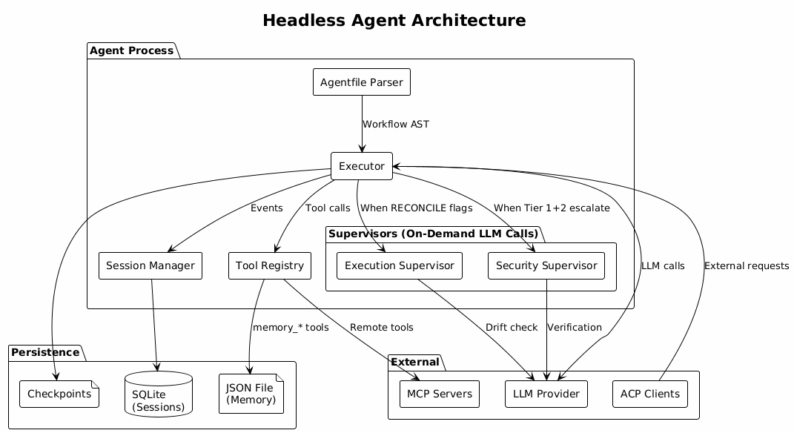

# Chapter 1: Architecture Overview

## System Components

The headless agent is a single process with several internal components:

## Component Summary

| Component | Purpose |
|-----------|---------|
| Agentfile Parser | Lexes and parses workflow definitions |
| Executor | Runs workflows, orchestrates phases |
| Tool Registry | Manages built-in and external tools |
| Session Manager | Tracks execution state and events |
| Security Supervisor | On-demand LLM call for injection detection |
| Execution Supervisor | On-demand LLM call for drift correction |

## Data Flow

1. **Input:** Agentfile + inputs provided via stdin (JSON-RPC 2.0)
2. **Parse:** Agentfile converted to workflow AST
3. **Execute:** Goals processed sequentially through phases
4. **Tools:** Agent calls tools via registry (local or MCP)
5. **Verify:** Security checks on tool calls, execution supervision on goals
6. **Persist:** Sessions to SQLite, memory to JSON, checkpoints to files
7. **Output:** Results returned via stdout (JSON-RPC 2.0)

## Transport

The agent uses **stdio** with JSON-RPC 2.0:

| Stream | Direction | Content |
|--------|-----------|---------|
| stdin | Client → Agent | Requests, inputs |
| stdout | Agent → Client | Responses, results |
| stderr | Agent → Client | Logs (structured) |

This enables embedding in any orchestration system — Docker, shell scripts, process managers.

## Supervisors Are Not Sub-Agents

The security supervisor and execution supervisor are **on-demand LLM calls**, not persistent sub-agents:

| Supervisor | Trigger | Cost |
|------------|---------|------|
| Security | Tool call when Tier 1+2 escalate | 1 LLM call |
| Execution | Goal when RECONCILE flags issues | 1 LLM call |

Both are stateless. No additional processes or persistent context.

## Process Lifecycle

1. Agent process starts
2. Reads configuration (agent.toml, credentials.toml, policy.toml)
3. Initializes LLM client, tool registry, session manager
4. Reads workflow request from stdin
5. Executes workflow
6. Writes result to stdout
7. Process exits (or waits for next request in server mode)

## Configuration Files

| File | Purpose | Permissions |
|------|---------|-------------|
| agent.toml | Agent settings, LLM config | 0644 |
| credentials.toml | API keys | 0400 (read-only) |
| policy.toml | Tool permissions | 0644 |

All configuration uses TOML format.

---

Next: [Agentfile DSL](02-agentfile.md)
