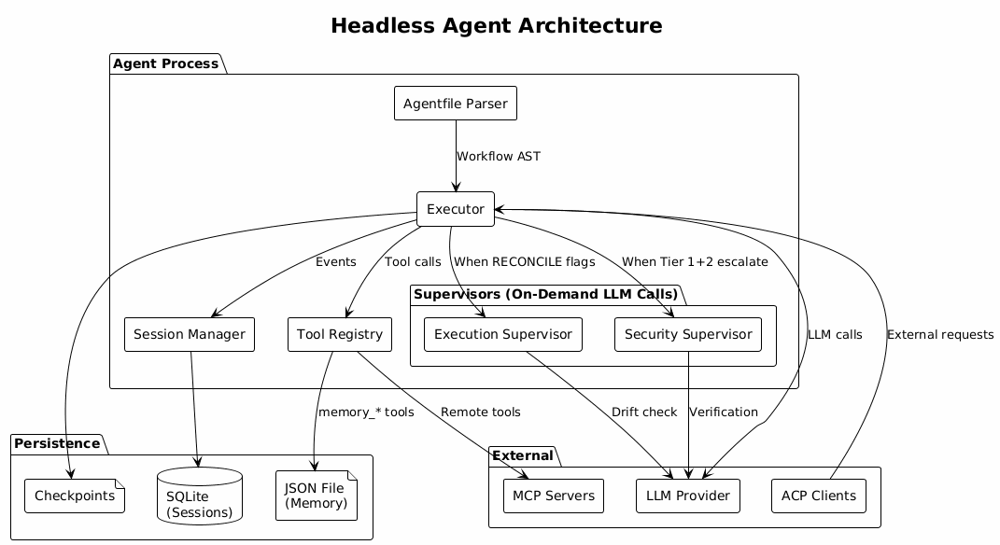
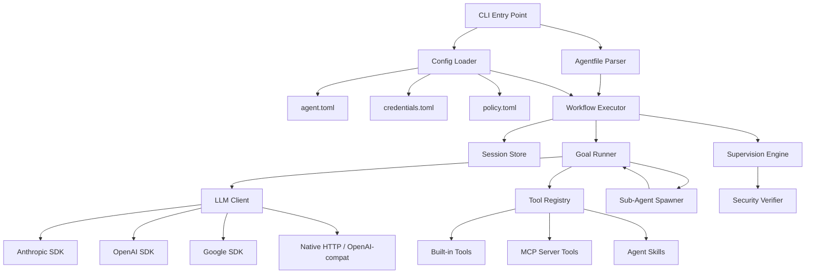

# Chapter 1: Architecture

## Overview

The headless agent is a CLI tool that executes workflows defined in Agentfiles using LLMs.



## Component Interaction


```mermaid
graph TD
    CLI[CLI Entry Point] --> Parser[Agentfile Parser]
    CLI --> ConfigLoader[Config Loader]

    ConfigLoader --> AgentTOML[agent.toml]
    ConfigLoader --> Credentials[credentials.toml]
    ConfigLoader --> Policy[policy.toml]

    Parser --> Executor[Workflow Executor]
    ConfigLoader --> Executor

    Executor --> SessionStore[Session Store]
    Executor --> GoalRunner[Goal Runner]

    GoalRunner --> LLMClient[LLM Client]
    GoalRunner --> ToolRegistry[Tool Registry]
    GoalRunner --> SubAgentSpawner[Sub-Agent Spawner]

    LLMClient --> Anthropic[Anthropic SDK]
    LLMClient --> OpenAI[OpenAI SDK]
    LLMClient --> Google[Google SDK]
    LLMClient --> NativeHTTP[Native HTTP / OpenAI-compat]

    ToolRegistry --> BuiltinTools[Built-in Tools]
    ToolRegistry --> MCPTools[MCP Server Tools]
    ToolRegistry --> SkillTools[Agent Skills]

    SubAgentSpawner --> GoalRunner

    Executor --> Supervisor[Supervision Engine]
    Supervisor --> SecurityVerifier[Security Verifier]
```

## Components

| Component | Description |
|-----------|-------------|
| CLI | Commands: run, validate, inspect, pack, verify, install, setup, serve |
| Agentfile Parser | Lexer and parser for workflow DSL |
| Executor | Runs workflows through goals and steps |
| Goal Runner | Executes individual goals with agentic tool-calling loop |
| Tool Registry | Built-in tools + MCP server tools + Agent Skills |
| Session Store | Tracks execution state |
| LLM Client | Multi-provider LLM abstraction |
| Supervision Engine | Four-phase commit/execute/reconcile/supervise |
| Security Verifier | Three-tier verification pipeline |
| Sub-Agent Spawner | Static (AGENT/USING) and dynamic (spawn_agent) sub-agents |

## Data Flow

The following describes how a user request flows through the system:

```
User Input (CLI args, --input flags)
    |
    v
1. Config Loading
   - agent.toml    --> LLM settings, profiles, storage
   - credentials   --> API keys (env > .env > credentials.toml)
   - policy.toml   --> Tool permissions, security rules
    |
    v
2. Agentfile Parsing
   - Lexer tokenizes the DSL
   - Parser builds: NAMEs, INPUTs, AGENTs, GOALs, RUNs, LOOPs
   - Variable references ($var) are recorded
    |
    v
3. Workflow Execution (Executor)
   - Resolves RUN/LOOP steps into ordered goal sequences
   - For each goal:
     |
     v
   3a. COMMIT Phase (if supervised)
       - Agent declares intent, approach, expected output
     |
     v
   3b. EXECUTE Phase
       - Goal prompt assembled with XML context (<workflow>, <context>, <current-goal>)
       - Previous goal outputs injected as variables
       - Sub-agents (USING) spawned in parallel if declared
       - Agentic loop: LLM -> tool calls -> LLM -> ... until done
       - Tool calls pass through Security Verifier (Tier 1/2/3)
     |
     v
   3c. RECONCILE Phase (if supervised)
       - Static pattern matching: commitment met? deviations? low confidence?
     |
     v
   3d. SUPERVISE Phase (if reconcile flags concerns)
       - LLM evaluates drift: CONTINUE, REORIENT, or PAUSE
     |
     v
   3e. Output Capture
       - Structured output (-> fields) parsed as JSON
       - Fields become variables for subsequent goals
    |
    v
4. Result
   - Final goal outputs returned
   - Session state persisted
   - Audit trail written
```

## How the Agent Uses Agentkit Packages

The agent is built on top of the `agentkit` library, which provides the core abstractions:

| Agentkit Package | Used For |
|------------------|----------|
| `agentkit/llm` | Multi-provider LLM client abstraction, model routing, thinking modes |
| `agentkit/tools` | Tool registry, tool execution, parameter validation |
| `agentkit/mcp` | MCP client for connecting to external tool servers |
| `agentkit/security` | Trust-tagged content blocks, verification pipeline, taint tracking |
| `agentkit/memory` | BM25 index, semantic graph, KV store, observation extraction |
| `agentkit/session` | Session state management, checkpointing |
| `agentkit/transport` | JSON-RPC transport for ACP/A2A communication |

The agent CLI (`cmd/agent`) wires these packages together:

1. **Config** loads `agent.toml` and creates an `llm.Client` with the appropriate provider
2. **Parser** (in `internal/agentfile`) produces a workflow AST
3. **Executor** (in `internal/executor`) walks the AST, using `agentkit/llm` for LLM calls and `agentkit/tools` for tool dispatch
4. **Security** (from `agentkit/security`) wraps every tool call with verification
5. **Memory** (from `agentkit/memory`) provides `remember`/`recall` tools backed by BM25 + semantic graph

## Configuration Files

| File | Purpose | Permissions |
|------|---------|-------------|
| agent.toml | Agent settings, LLM config, profiles | 0644 |
| credentials.toml | API keys | 0400 (required) |
| policy.toml | Tool permissions, security policy | 0644 |

Location: Current directory, or `~/.config/grid/` for credentials.

## API Key Loading

Priority order (highest to lowest):

1. Environment variables
2. `.env` file in current directory
3. `~/.config/grid/credentials.toml`

For credentials.toml, provider-specific sections override `[llm]`:

```toml
[llm]
api_key = "default-key"

[anthropic]
api_key = "anthropic-specific-key"
```

## CLI Commands

| Command | Description |
|---------|-------------|
| run | Execute a workflow |
| validate | Check syntax without running |
| inspect | Show workflow/package structure |
| pack | Create a signed package |
| verify | Verify package signature |
| install | Install a package |
| keygen | Generate signing key pair |
| setup | Interactive setup wizard |
| serve | Run as A2A/ACP server |

## Protected Files

The agent cannot modify its own configuration:
- agent.toml
- policy.toml
- credentials.toml

This prevents privilege escalation.

## Transport

The agent uses stdio with JSON-RPC for ACP integration. For standalone use, it's a standard CLI.

---

Next: [Agentfile DSL](02-agentfile.md)
