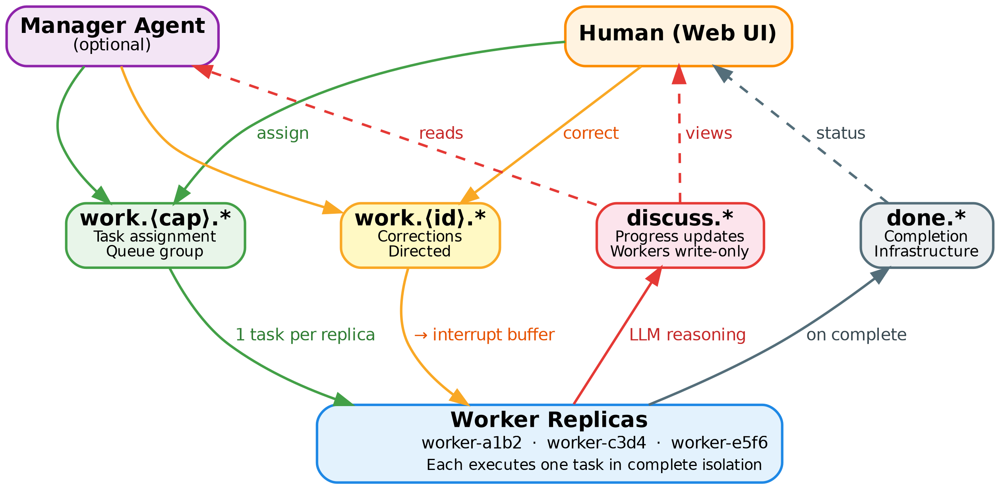
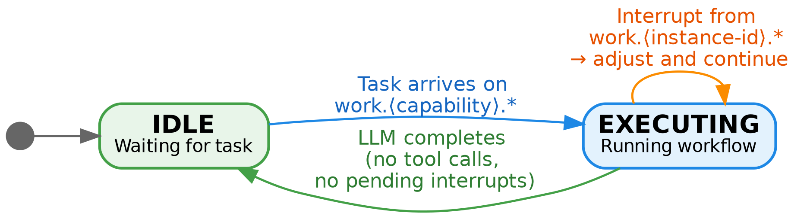

# Swarm Collaboration: Isolated Execution with Managed Coordination

*Design Document — March 2026*

---

## 1. Introduction

A swarm is a collection of autonomous agents working toward a common goal. Each agent brings a capability — writing code, running tests, generating documentation — and the swarm's power lies in parallel execution across those capabilities.

This document presents the collaboration model for swarm agents. The model is built on three principles:

1. **Workers execute in isolation.** A worker receives one task and executes it without awareness of other workers or their tasks. The only external input during execution is corrective guidance from a central authority.

2. **Coordination flows through a central authority.** That authority is either a human (via the swarm web UI) or a dedicated manager agent. The authority decomposes work, assigns tasks, monitors progress, and sends corrections.

3. **Transparency without contamination.** Workers post their reasoning to a broadcast channel so the authority can monitor progress. Workers never subscribe to this channel — they talk into a one-way mirror.

### 1.1 Design Principles

**Isolation over collaboration.** Workers execute in isolation. They do not see each other's reasoning, output, or progress. The only external signal during execution comes from the manager or human via a dedicated channel. An agent cannot drift into building components outside its scope if it has no awareness that those components exist.

**Authority-based coordination.** One entity — the manager agent or the human — has the full picture. It reads all worker updates, reasons about alignment and progress, and sends targeted corrections to specific workers. Workers never coordinate with each other directly.

**Wide capabilities, narrow tasks.** Agents are defined with broad capabilities (e.g., "fullstack development") rather than narrow specializations (e.g., "frontend only"). Tasks are decomposed into complete, independent features. Each worker receives one feature and builds it end-to-end. There is no scope overlap because there is no shared scope.

**Transparency without contamination.** Workers post their reasoning to a broadcast channel (`discuss.*`) so the manager and UI can monitor progress. But workers never subscribe to this channel. This provides full observability without cross-agent context leakage.

### 1.2 NATS Subject Routing



*Authority (manager/human) assigns tasks and corrections downward. Workers post updates and completion upward. Solid lines = write, dashed lines = read/observe.*

The swarm uses four NATS subject families with clearly separated read/write semantics.

**`work.<capability>.<task_id>` — task assignment (manager/human → workers).**

The primary channel for assigning work. Workers subscribe to `work.<capability>.*` using NATS queue groups. When multiple replicas share the same capability, NATS delivers each task to exactly one worker — load balancing automatically. The manager or human publishes tasks here without needing to know which specific worker instance will handle them.

This is a write channel for the manager/human and a read channel for workers.

*JetStream note:* The swarm startup creates a JetStream stream covering all subject families (`work.>`, `discuss.>`, `done.>`, `heartbeat.>`). All messages are durable. Without JetStream, NATS falls back to Core NATS (fire-and-forget) and messages arriving while an agent is busy are silently lost.

**`work.<instance-id>.<task_id>` — corrective guidance (manager/human → specific worker).**

A directed channel for sending corrections, clarifications, or steering to a specific worker instance. Each worker subscribes to `work.<instance-id>.*` where `instance-id` is the worker's unique identifier (`<name>-<session-id>`). Messages on this channel feed directly into the worker's interrupt buffer (Section 4).

This is the sole mechanism for mid-execution course correction. Only the manager or human writes here. Workers never write to each other's instance channels.

**`discuss.<task_id>` — progress updates (workers → manager/UI).**

A broadcast channel where workers post their reasoning and progress. Every non-tool-call LLM response during execution is published here — decisions, conclusions, status updates, error descriptions. This provides full transparency into worker behavior.

**Workers write to `discuss.*` but never subscribe to it.** The channel is consumed by:
- The manager agent (if present), which uses it to monitor progress and decide on corrections.
- The swarm web UI, which displays worker activity to the human.

This one-way design is critical. Workers seeing each other's reasoning would give them context about the full system, inevitably leading to scope drift. The one-way mirror preserves transparency while preventing contamination.

**`done.<capability>.<task_id>` — completion metadata (workers → infrastructure).**

Published when a worker's execution terminates — whether through successful completion or failure. This channel serves infrastructure consumers: the web UI, metrics systems, task tracking, and future cross-swarm orchestration. No agent subscribes to `done.*`. It is a clean integration boundary between the swarm's internal execution and external systems interested in outcomes.

**`heartbeat.<instance-id>` — agent status.**

Periodic status updates from each agent. The manager and UI consume these for liveness detection and status display. Workers emit heartbeats but do not consume others' heartbeats — they have no need for peer awareness.

### 1.3 Channel Summary

| Channel | Writers | Readers | Purpose |
|---------|---------|---------|---------|
| `work.<capability>.*` | Manager, Human | Workers (queue group) | Task assignment |
| `work.<instance-id>.*` | Manager, Human | Specific worker | Corrective guidance |
| `discuss.*` | Workers | Manager, Web UI | Progress updates |
| `done.*` | Workers | Web UI, Infrastructure | Completion metadata |
| `heartbeat.*` | All agents | Manager, Web UI | Liveness |

---

## 2. Roles

### 2.1 Workers

Workers are the execution engines of the swarm. They receive tasks, execute them, and report results. A worker's lifecycle is:

1. **Start.** Subscribe to `work.<capability>.*` (queue group) and `work.<instance-id>.*` (direct). Begin emitting heartbeats.
2. **Receive task.** A message arrives on `work.<capability>.*`. The worker transitions to EXECUTING.
3. **Execute.** Run the workflow defined in the Agentfile. Post all non-tool-call LLM responses to `discuss.<task_id>`. Check interrupt buffer between LLM turns for corrective guidance from `work.<instance-id>.*`.
4. **Complete.** Publish result to `discuss.<task_id>` and `done.<capability>.<task_id>`. Return to IDLE.

Workers have no awareness of other workers. They do not know how many peers exist, what tasks others are handling, or what progress others have made.

### 2.2 Manager

The manager is an optional orchestrator agent, defined by an Agentfile with `type: manager` in the swarm manifest. What makes it a manager is not special code but its NATS subscriptions and its Agentfile persona.

A manager automatically receives:
- **Read** `discuss.*` — sees all worker updates and reasoning.
- **Read** `heartbeat.*` — sees all worker status.
- **Write** `work.<capability>.*` — assigns tasks to capability groups.
- **Write** `work.<instance-id>.*` — sends corrective guidance to specific workers.

The manager's Agentfile defines how it reasons about task decomposition, progress monitoring, and course correction. It sees the full picture — all worker output, all task status — and acts as the central coordinator.

A swarm has at most one manager. Multi-manager coordination is a Hive concern.

### 2.3 Human (No Manager)

When no manager agent is defined in the swarm manifest, the human drives coordination directly through the swarm web UI. The human:

- Monitors worker progress via `discuss.*` displayed in the web UI.
- Assigns tasks by publishing to `work.<capability>.*`.
- Sends corrections by publishing to `work.<instance-id>.*`.

The web UI surfaces worker updates, heartbeat status, and task completion in real time. The human makes all coordination decisions. This is the simplest deployment model and is sufficient for small swarms (2–5 workers).

---

## 3. The Worker State Machine



*Two-state lifecycle. IDLE is the resting state. EXECUTING runs the workflow with interrupt awareness. Corrections from the manager arrive as interrupts without leaving the EXECUTING state.*

Workers operate in exactly two states.

### 3.1 States

**IDLE.** The worker is waiting for a task. It is subscribed to `work.<capability>.*` and `work.<instance-id>.*`, emitting heartbeats, and taking no action. This is the resting state.

**EXECUTING.** The worker is actively running its workflow — invoking tools, generating code, processing data. During execution:
- All non-tool-call LLM responses are published to `discuss.<task_id>`.
- The interrupt buffer collects messages from `work.<instance-id>.*`.
- Between LLM turns, the interrupt buffer is drained and its contents injected into the next LLM context.

### 3.2 Transitions

**IDLE → EXECUTING.** Triggered when a task arrives on `work.<capability>.*`. The worker initializes its interrupt buffer, begins workflow execution, and starts posting updates to `discuss.<task_id>`.

**EXECUTING → IDLE.** Triggered when the agentic loop terminates (the LLM produces a text response with no tool calls and no pending interrupts). The worker publishes its final output to both `discuss.<task_id>` and `done.<capability>.<task_id>`, then returns to IDLE.

### 3.3 State Visibility

Each worker's current state is communicated via the heartbeat mechanism. The heartbeat includes: instance ID, capability, current state (IDLE or EXECUTING), current task ID (if executing), and timestamp. The manager and web UI use this to display swarm status.

---

## 4. Execution with Interrupts


*The execution loop. After each LLM turn, the worker checks for tool calls. Tool results and interrupt buffer contents feed the next turn. The loop exits when the LLM produces text-only output with no pending interrupts.*

During execution, a worker is not completely deaf. The manager or human can send corrective guidance via `work.<instance-id>.*`, which feeds into the worker's interrupt buffer. This is the only external input during execution.

### 4.1 The Interrupt Buffer

When a worker transitions to EXECUTING, it initializes an interrupt buffer — a thread-safe FIFO queue that collects messages arriving on `work.<instance-id>.*`. The NATS subscriber writes to this buffer; the executor reads from it.

### 4.2 Injection Point

The interrupt buffer is checked at exactly one point in the execution cycle: **between LLM turns, after all tool results have been collected and before the next LLM invocation.**

The execution cycle of a single iteration is:

1. LLM receives context (messages, tool results, interrupts if any).
2. LLM produces a response (text, tool calls, or both).
3. All non-tool-call text is published to `discuss.<task_id>`.
4. If tool calls are present, all requested tools execute (possibly in parallel).
5. Tool results are collected.
6. **Interrupt check: drain the buffer.**
7. Tool results (and any interrupts) are assembled into the next LLM turn.
8. Return to step 1.

When the LLM produces text with no tool calls:

1. Drain the interrupt buffer.
2. If interrupts are present: format them into the context and continue the loop (the LLM re-evaluates before terminating).
3. If no interrupts: the loop terminates. Publish final output to `discuss.*` and `done.*`.

This ensures the LLM always sees pending corrections before finalizing its output.

### 4.3 The Interrupts Block

When the interrupt buffer contains messages, they are formatted into an XML block:

```xml
<interrupts>
  <context>
    Current goal: Implement user registration feature with email
    verification, REST API, database schema, and frontend form.
  </context>

  <messages>
    <message from="orchestrator" timestamp="2026-03-08T14:30:00Z">
      The email verification flow should use magic links, not
      6-digit codes. Update the token generation and verification
      endpoint accordingly.
    </message>
  </messages>

  <guidance>
    The above messages are corrective guidance from the swarm
    manager. Evaluate them against your current work and adjust
    your approach for remaining steps. These messages take
    priority over your current plan where they conflict.
  </guidance>
</interrupts>
```

The **context** element states the worker's current goal (from the Agentfile, generated deterministically by the executor). The **messages** element contains the raw guidance, preserving attribution and timestamps. The **guidance** element frames the messages as authoritative corrections — these are directives from the coordination authority, not suggestions to weigh.

### 4.4 Solo Agent Compatibility

When a worker runs outside a swarm (no NATS connection), the interrupt buffer is never created (nil) and the buffer drain check short-circuits in nanoseconds. The execution loop behaves identically to a non-collaborative agent. The collaboration machinery is purely additive — it activates only when NATS subscriptions exist.

---

## 5. Progress Updates on discuss.*

Every non-tool-call LLM response during execution is automatically published to `discuss.<task_id>`. This includes:

- Reasoning about approach ("I'll start with the database schema, then build the API endpoints").
- Decisions ("Using JWT for session tokens instead of opaque tokens").
- Status updates ("Database migration complete, moving to API handlers").
- Error descriptions ("Tests failing on email validation, investigating").
- Final results ("Feature complete. Registration flow handles email verification via magic links").

This provides the manager and human with a real-time stream of each worker's thinking. The manager can:
- Detect drift early ("Worker is building OAuth when the task was email/password registration").
- Identify blockers ("Worker has been stuck on SMTP configuration for 10 minutes").
- Coordinate dependencies ("Worker A finished the API; time to assign testing to Worker B").

Workers publish to `discuss.*` but never subscribe. They are unaware that anyone is reading their updates. From the worker's perspective, this is simply externalizing its reasoning.

### 5.1 Update Format

Each discuss message includes:

- `instance_id` — which worker posted this.
- `task_id` — which task it relates to.
- `timestamp` — when the update was generated.
- `content` — the LLM's non-tool-call text output.
- `goal` — the current goal being executed (from the Agentfile).

The structured metadata allows the manager and UI to filter, group, and display updates by worker, task, or time.

---

## 6. Context Management

Workers execute in isolation, so there is no cross-agent context to manage. The only context concerns are:

### 6.1 Interrupt History

During execution, processed interrupts accumulate in the conversation context. If many corrections arrive over a long execution, the raw interrupt history can grow large. Processed interrupts are consolidated using the same summarization approach as the existing agent implementation: a small LLM summarizes older interrupts while preserving recent ones verbatim.

### 6.2 Discuss Output

Publishing to `discuss.*` has zero impact on the worker's own context — it is a fire-and-forget write. The worker's context contains only its task, its tool results, and any interrupt messages. No peer context, no swarm state, no discussion history.

### 6.3 Manager Context

The manager agent's context is the primary scaling concern. It reads all `discuss.*` messages and must reason about the full swarm state. For large swarms with many workers, the discuss stream can grow substantial.

The manager's Agentfile should define summarization strategies — for example, maintaining per-worker summaries rather than raw message logs. The existing context summary threshold mechanism applies: when discuss messages for a task exceed the threshold, older messages are summarized.

---

## 7. Scenarios

### 7.1 Feature Development with Multiple Workers

**Setup:** Three `fullstack` worker replicas, one manager, building a web application.

**Task:** "Build a user management system with registration, login, and profile editing."

1. Manager receives the task (via `work.<manager-instance-id>.*` from human, or from its own Agentfile goals).

2. Manager decomposes into features:
   - Feature 1: User registration with email verification
   - Feature 2: Login with session management
   - Feature 3: Profile editing with avatar upload

3. Manager publishes three tasks to `work.fullstack.*`:
   - `work.fullstack.task-registration` — "Build user registration with email verification. Use magic links. Database schema, API endpoints, frontend form."
   - `work.fullstack.task-login` — "Build login with session management. JWT tokens. Login form, auth middleware, session endpoints."
   - `work.fullstack.task-profile` — "Build profile editing with avatar upload. Profile page, update endpoint, file storage."

4. NATS queue group delivers one task to each replica. Each worker sees only its own task.

5. Workers execute in isolation. Each posts reasoning to `discuss.*`:
   - `fullstack-a1b2`: "Starting registration. Creating users table migration..."
   - `fullstack-c3d4`: "Starting login. Setting up JWT signing..."
   - `fullstack-e5f6`: "Starting profile. Designing avatar storage..."

6. Manager monitors discuss. Sees `fullstack-a1b2` post: "Using 6-digit codes for email verification." Manager sends correction to `work.fullstack-a1b2.task-registration`: "Use magic links, not 6-digit codes."

7. `fullstack-a1b2` receives correction in interrupt buffer at next check. Adjusts approach.

8. All three workers complete independently. Manager sees three DONE messages. Assigns integration task if needed.

**Key property:** No worker knows the other features exist. `fullstack-a1b2` cannot drift into building login because it has no awareness that login is a task.

### 7.2 Human-Driven Swarm (No Manager)

**Setup:** Two `fullstack` worker replicas, no manager, human using web UI.

1. Human sees two idle workers in the web UI.

2. Human submits two tasks via the UI:
   - "Build the REST API for product catalog" → published to `work.fullstack.*`
   - "Build the admin dashboard" → published to `work.fullstack.*`

3. NATS delivers one task per worker.

4. Human watches progress in the web UI via `discuss.*` updates.

5. Human notices one worker is building a GraphQL API instead of REST. Human sends correction via the UI: "Use REST, not GraphQL. Follow the OpenAPI spec in /docs/api.yaml."

6. Worker receives correction, adjusts.

**Key property:** The web UI replaces the manager agent. Same channels, same flow, human intelligence instead of LLM intelligence for coordination.

### 7.3 Course Correction via Manager

**Setup:** Manager + workers building a microservices system.

1. Manager assigns "Build the payment service" to `work.backend.*`.

2. Worker begins executing. Posts to discuss: "Implementing Stripe integration for payment processing."

3. Manager, reading discuss, knows from a prior human directive that the company uses Adyen, not Stripe. Manager sends to `work.backend-x1y2.task-payment`: "Use Adyen, not Stripe. SDK docs at /vendor/adyen/README.md."

4. Worker receives correction at next interrupt check. Switches to Adyen integration.

5. Worker posts to discuss: "Switching to Adyen per orchestrator guidance. Updating payment gateway abstraction."

6. Manager confirms alignment. No further correction needed.

### 7.4 Dependency Sequencing

**Setup:** Manager + `coder` and `tester` workers.

1. Manager assigns "Implement the search API" to `work.coder.*`.

2. Coder executes, posts progress to discuss. Manager monitors.

3. Coder completes. DONE message appears on `discuss.*` and `done.coder.*`.

4. Manager sees completion. Assigns "Write integration tests for the search API" to `work.tester.*`, including relevant context from coder's discuss output.

5. Tester executes against coder's output.

**Key property:** The manager sequences dependent work. Workers do not wait for each other — the manager handles timing.

---

## 8. Task Lifecycle

A task is assigned by the manager or human via `work.<capability>.*`. It is considered in-progress when a worker picks it up (visible via heartbeat state change). It is considered complete when the worker publishes to `done.<capability>.<task_id>`.

The manager tracks task status by correlating:
- Task assignments it published on `work.<capability>.*`.
- Worker state changes from `heartbeat.*`.
- Progress updates from `discuss.*`.
- Completion signals from `done.*` (or `discuss.*` DONE messages).

If a worker crashes mid-execution (heartbeat goes stale), the manager detects this and may reassign the task to another available worker via `work.<capability>.*`. The new worker starts fresh — there is no resume mechanism. Partial work from the crashed worker remains on disk and may be useful context if the manager includes it in the reassignment.

---

## 9. Swarm Manifest

```yaml
# swarm.yaml
nats:
  url: nats://localhost:4222

storage:
  root: ~/.local/share/swarm

agents:
  - name: orchestrator
    agentfile: ./agents/orchestrator.agent
    config: ./agents/agent.toml
    type: manager

  - name: fullstack
    agentfile: ./agents/fullstack.agent
    config: ./agents/agent.toml
    capability: fullstack
    type: worker          # default, can be omitted
    replicas: 3

collaboration:
  interrupt_check: true
```

### 9.1 Agent Fields

- `name` — Display name (required). For replicated workers, the runtime generates instance IDs as `<name>-<session-id>`.
- `agentfile` — Path to Agentfile (required).
- `config` — Path to agent.toml (optional, uses defaults if omitted).
- `policy` — Path to policy.toml (optional).
- `capability` — Capability name for work channel subscription (defaults to Agentfile NAME).
- `type` — `worker` (default) or `manager`. At most one `manager` per swarm.
- `replicas` — Number of instances to spawn (default: 1). Only meaningful for workers. Each replica subscribes to the same `work.<capability>.*` queue group.

### 9.2 Instance IDs

Each agent instance gets a unique identifier: `<name>-<session-id>`. The session ID is generated at spawn time.

- Instance IDs are used for directed channels (`work.<instance-id>.*`), heartbeat identification, and discuss message attribution.
- The swarm web UI supports tab completion: typing the agent name followed by the first few characters of the session ID resolves to the full instance ID.

### 9.3 Collaboration Settings

```yaml
collaboration:
  interrupt_check: true
```

**interrupt_check** (default: true). Whether executing workers check the interrupt buffer between LLM turns. When false, workers execute in complete isolation — no mid-execution corrections possible. When true, workers process corrective guidance from `work.<instance-id>.*`.

---

## 10. Manager Agentfile Design

The manager agent is defined by a standard Agentfile. Its effectiveness depends on the Agentfile's goals and persona. A typical manager Agentfile includes:

**Persona:** "You are a technical project manager. You decompose tasks into independent features, assign them to workers, monitor progress, and send corrections when workers drift from requirements."

**Goals:**
- Decompose incoming tasks into independent, parallelizable features.
- Assign features to workers via `work.<capability>.*`.
- Monitor `discuss.*` for progress updates and drift.
- Send corrections via `work.<instance-id>.*` when workers deviate.
- Sequence dependent work (assign testing after coding completes).
- Report overall progress and results.

**Tools:** The manager needs access to NATS publishing tools — these are provided automatically by the swarm runtime when `type: manager` is set.

The manager does NOT need:
- `bash` or file system tools (it does not write code).
- MCP connections for external services (unless it manages integrations).
- The same tools as workers.

This role separation — manager reasons and coordinates, workers execute — ensures the manager cannot accidentally do workers' jobs, and workers cannot accidentally do each other's jobs.

---

## 11. Open Questions

**Integration across features.** When multiple workers build independent features, integration is needed: shared routing, consistent styling, compatible APIs. Options include a shared scaffold committed before workers start, a dedicated integration pass after features complete, or the manager including integration constraints in task descriptions. The right approach likely depends on the project.

**Manager scalability.** The manager reads all `discuss.*` output. For large swarms (10+ workers), the discuss stream may overwhelm a single manager's context. Summarization strategies, per-worker digests, or attention-based filtering may be needed. For the local swarm use case (2–10 workers), this is unlikely to be a problem.

**Replica count determination.** The `replicas` count in swarm.yaml is static — set before the swarm starts. For dynamic workloads where the number of features is unknown upfront, the manager would need to request additional replicas at runtime. This is a Hive concern (dynamic spawning via dispatcher) rather than a swarm concern.

**Task reassignment on failure.** When a worker crashes, the manager can reassign the task. But the new worker starts fresh — there is no mechanism to resume from the crashed worker's partial state. For long-running tasks, this means significant wasted compute. Checkpointing and resume are deferred as a future enhancement.

**Manager failure.** If the manager crashes, workers continue executing their current tasks but no new coordination occurs. Workers complete and return to IDLE with no one to assign new work. The human must intervene via the web UI. Manager resilience (restart, state recovery) is a Hive concern.

---

## Appendix A: Why Not Peer Collaboration?

An earlier iteration of this design attempted peer-to-peer coordination. Agents would deliberate on a shared `discuss.*` channel, publish CLAIMs describing what they would build, and self-organize into complementary roles. This approach was abandoned after consistent failures across all tested models.

### The Failure Pattern

1. Agents deliberate and publish CLAIMs specifying narrow scope ("I'll handle the frontend only").
2. Agents begin executing. Within their own context, the CLAIM becomes a distant memory.
3. Each agent builds the complete system — frontend, backend, infrastructure — because every LLM has been trained on complete projects and the gravitational pull toward completeness is overwhelming.
4. The swarm produces N independent implementations of the same feature instead of N complementary pieces.

### Root Causes

**Completion bias is structural, not behavioral.** As an agent generates more code, its own output dominates the context window. The original scope constraint gets diluted. An agent that has written 2000 lines of frontend code "knows" there should be a backend — and it builds one. This is not a prompting problem or a model quality problem. It is a property of how LLMs process expanding context.

**CLAIMs are unenforceable.** CLAIMs are text. The LLM that wrote the CLAIM is the same LLM that ignores it. No amount of prompt engineering reliably prevents drift when the agent has the tools and context to build everything.

**Peer context enables drift.** When agents see each other's reasoning via a shared discussion channel, they gain awareness of the full system. This awareness triggers completion bias — the agent cannot resist building parts it knows about.

**The failure is model-independent.** Tested across Opus, Qwen, MinMax, GPT variants, and others. All exhibited the same drift pattern.

### Supervision Was Considered and Rejected

A swarm supervisor — a separate agent or process that checks each worker's output against its CLAIM — was evaluated as an alternative to isolation. The supervisor would gate tool calls, file writes, or commits, rejecting anything outside the worker's declared scope.

This approach fails for two reasons:

1. **Scope drift is a semantic judgment.** Determining whether a file write is "in scope" requires understanding the full context of the task, the CLAIM, and the code being written. No static check or template match can catch "you're building the login API but that's another agent's job." Every check requires an LLM call.

2. **The overhead is prohibitive.** Gating every write, bash call, or network call with an LLM supervisor call adds enormous latency and cost. Batching reduces frequency but not the fundamental expense. Per-commit gating only works for git-backed workflows, not general MCP-to-MCP pipelines.

Isolation eliminates the need for supervision entirely. An agent cannot drift into building the backend if it has no awareness that a backend exists.
