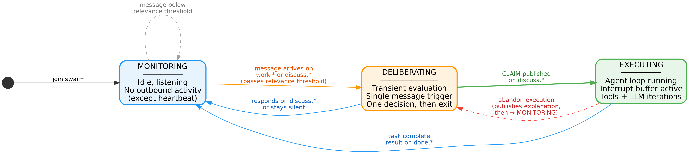
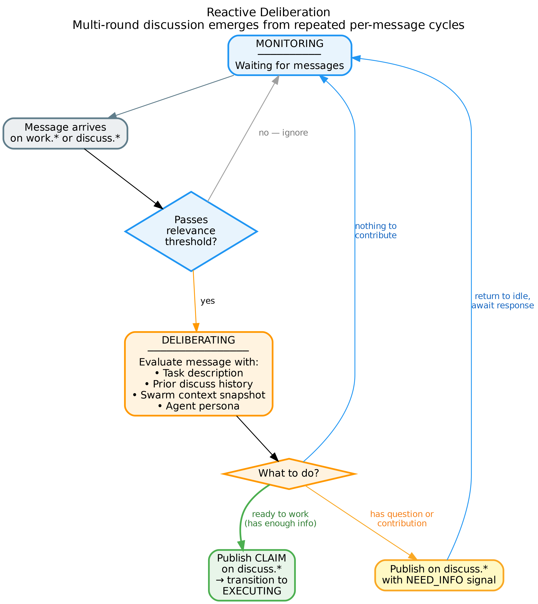
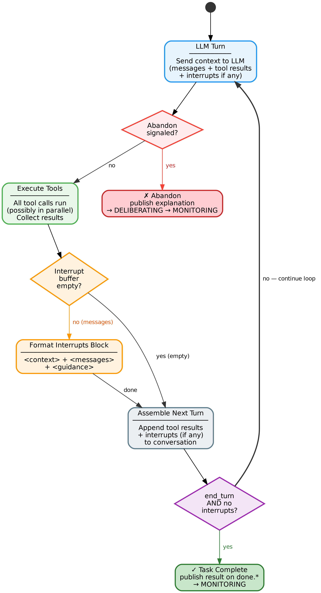

# Swarm Collaboration: Deliberation, Interrupts, and Shared Context

*Design Document — March 2026*

---

## 1. Introduction

A swarm is a collection of autonomous agents working toward a common goal. Each agent brings a distinct capability — one writes frontend code, another handles backend logic, a third manages infrastructure. The power of a swarm lies not in individual agent capability, but in how agents coordinate: how they divide work, share discoveries, adapt to changing circumstances, and converge on a coherent result.

This document presents a collaboration model for swarm agents built on three interconnected mechanisms: **deliberation**, **execution with interrupts**, and **shared swarm context**. Together, these mechanisms transform agents from isolated workers that receive tasks and produce outputs into collaborative participants that discuss, negotiate, adapt, and align.

### 1.1 The Problem with the Current Model

The current swarm design follows a **decide-execute-forget** pattern:

1. A task arrives on `work.<capability>.<task_id>` or `discuss.<task_id>`.
2. A single LLM call triages the task, producing one of three outcomes: EXECUTE, COMMENT, or SKIP.
3. If EXECUTE, the agent runs its workflow linearly, producing a result on `done.<capability>.<task_id>`.
4. If COMMENT, the agent publishes a single message on `discuss.<task_id>` and moves on.
5. If SKIP, the task is ignored entirely.

This model has three fundamental deficiencies:

**Triage is a point-in-time bet.** The agent makes an irrevocable decision based on whatever context exists at the moment the task arrives. There is no mechanism to revise this decision as new information surfaces. An agent that SKIPs a task cannot later decide it was relevant. An agent that EXECUTEs cannot discover, mid-execution, that another agent has already solved the problem differently.

**Execution is deaf.** Once an agent begins executing, it enters a closed loop: LLM generates tool calls, tools execute, results feed back to the LLM, repeat until the goal is satisfied. No external information penetrates this loop. If the frontend agent announces on `discuss.*` that it has switched from REST to WebSocket, the backend agent — currently writing REST handlers — will not hear this until it publishes its now-incompatible result.

**Discussion is fire-and-forget.** A COMMENT decision produces a single message. There is no mechanism for back-and-forth deliberation, for building shared understanding through dialogue, or for agents to negotiate who handles what. The discuss channel exists, but agents use it as a bulletin board, not a conversation medium.

### 1.2 Design Principles

The collaboration model presented here is guided by five principles:

**Agents are participants, not workers.** A worker receives instructions and produces output. A participant engages with the problem, discusses approaches with peers, adapts to changing circumstances, and takes ownership of a self-determined portion of the work. The collaboration model treats agents as the latter.

**Discussion and execution are interleaved, not sequential.** In human teams, a developer does not wait for all discussion to conclude before writing any code. They discuss, start working, encounter something unexpected, discuss again, adjust, continue. The collaboration model supports this natural rhythm.

**Awareness is continuous, not episodic.** An agent should always have access to what is happening in the swarm — who is working on what, what decisions have been made, what remains unresolved. This awareness should be maintained passively, without requiring the agent to explicitly request it.

**Coordination emerges from communication, not from central control.** There is no dispatcher that assigns work to agents. Agents observe the swarm state, participate in discussion, and self-select their contributions. The NATS messaging infrastructure provides the communication substrate; the agents provide the intelligence.

**Information value is proportional to surprise.** Shannon's information theory provides the guiding heuristic for how agents allocate reasoning effort across their inputs. This is not specific to swarm collaboration — it is a general agent reasoning principle, injected into every agent's system prompt, that governs how the LLM weighs everything in its context window: tool results, prior goals, corrections, instructions, and any structured block. A signal's information content is inversely proportional to its probability — routine confirmations carry almost no information, while contradictions, novel constraints, and unexpected changes carry high information. In the swarm context specifically, this means: an interrupt announcing a technology migration matters more than ten status heartbeats, and a single dissenting CLAIM matters more than five agreeing ones. The principle also governs context summarization (Section 6): high-entropy signals are preserved verbatim, low-entropy consensus is compressed.

### 1.3 NATS Subject Routing

The swarm uses four NATS subject families. Three of them — `work.*`, `discuss.*`, and `done.*` — carry task-related messages. The fourth — `heartbeat.*` — carries agent status. Understanding the routing semantics of each is essential, because the choice of subject determines *who sees the message*, which directly affects collaboration.

**`discuss.<task_id>` — broadcast to all agents.** Every agent in the swarm receives every message published to `discuss.*`. This is the primary channel for collaboration: task submission, deliberation, questions, status updates, and abandonment explanations. When a task requires multiple agents to deliberate and self-select their roles, it is submitted on `discuss.*` so that all agents can participate.

*JetStream note:* Running `nats-server -js` enables JetStream on the server, but streams must be explicitly created for subjects to benefit from durability. The swarm startup creates a single JetStream stream covering all subject families (`discuss.>`, `work.>`, `done.>`, `heartbeat.>`). There is no reason to selectively apply durability — all messages in the swarm are worth preserving. Without JetStream streams, NATS falls back to Core NATS (fire-and-forget) and messages arriving while an agent is busy are silently lost.

**`work.<capability>.<task_id>` — load-balanced within a capability.** Agents subscribe to `work.<capability>.*` using NATS queue groups. When a message arrives, NATS delivers it to exactly one agent within the matching queue group — the one with the least pending messages. If a swarm has three frontend agents, only one of them receives a message on `work.frontend.*`. The other two never see it.

This has a critical implication for collaboration: **`work.<capability>.*` is not suitable for tasks that require multi-agent deliberation.** The message reaches only one agent per capability, so other agents cannot participate in discussion or self-select their roles. Use `work.<capability>.*` when you already know which capability should handle a task and want NATS to select the best available agent — effectively bypassing deliberation for directed assignment.

There is a subtlety when the capability segment is omitted or wildcarded. A message published to a subject that matches multiple capability queue groups — for example, if agents subscribe with overlapping patterns — will be delivered to one agent *per matching queue group*. In a swarm where each agent subscribes to a distinct capability (`work.code.*`, `work.test.*`, `work.infra.*`), a broadly-targeted work message reaches one agent per capability. This resembles a broadcast, but it is not: if multiple agents share the same capability, only one per capability receives the message. For true broadcast semantics, use `discuss.*`.

**`work.<name>.<task_id>` — directed to a specific agent.** When an agent subscribes to `work.<name>.*` (where `name` is its unique agent name rather than a shared capability), messages on this subject reach that specific agent. This is the channel for agent-to-agent private communication: "hey backend, here's the callback URL format you asked about." The sending agent resolves the target name from the agent directory in swarm context (Section 5.2).

**`done.<capability>.<task_id>` — outcome-oriented integration seam.** Published when an agent's execution terminates — whether through successful completion or abandonment. Agents **write** to this subject but **never subscribe** to it. The separation is deliberate: `discuss.*` carries the collaborative flow of execution — deliberation, interrupts, CLAIMs, questions, and incidentally, outcome announcements. It is noisy by design, optimized for agents that need full context to make decisions. `done.*` carries a fundamentally different signal: the fact that an agent's work on a task has concluded, with the agent's final output.

This distinction exists because future software systems will care about task *outcomes* without caring about task *execution*. A billing system needs to know that an agent's work concluded and how many tokens it consumed — regardless of whether the outcome was success or abandonment. A webhook relay needs to notify an external service when a task progresses. A cross-swarm orchestrator needs to know that a dependency was satisfied (or that it won't be). An audit log needs a clean record of what happened. None of these systems want to parse the collaborative discussion stream to extract outcome events — they want a dedicated, structured, noise-free channel where every message means exactly one thing: an agent concluded its work on a task.

By having agents publish to `done.*` even though no agent subscribes to it, the swarm creates an integration point that can be consumed by any number of non-agent systems without coupling them to the agent collaboration protocol. The `done.*` stream is stable, structured, and self-contained — a clean API boundary between the swarm's internal collaboration and the external world's interest in its output.

Agents learn about completions through `discuss.*`. When an agent finishes execution, it publishes a DONE message on `discuss.<task_id>` (which all agents see) and simultaneously publishes structured completion metadata on `done.<capability>.<task_id>` (which only infrastructure and external systems see). One event, two channels, no overlap in subscribers.

**`heartbeat.<name>` — agent status.** Periodic status updates from each agent. All agents receive these, maintaining the live agent directory in swarm context.

The key takeaway: **`discuss.*` is the collaboration channel. `work.*` is the assignment channel.** Tasks that need deliberation go to `discuss.*`. Tasks that need direct execution go to `work.<capability>.*`. Agent-to-agent messages go to `work.<name>.*`. The design doc uses these channels accordingly in all subsequent sections and scenarios.

---

## 2. The Agent State Machine



*Figure 1: The three-state agent lifecycle. MONITORING is the stable resting state. DELIBERATING is transient — triggered by each incoming message, producing a single decision, then returning to MONITORING. EXECUTING runs the agent loop with interrupt awareness. The dashed abandon path routes through DELIBERATING (to publish an explanation) before returning to MONITORING.*

At any moment, a swarm agent is in exactly one of three states. These states govern how the agent processes incoming messages, whether it participates in discussion, and whether it is actively executing work.

### 2.1 States

**MONITORING.** The agent is idle, listening to all NATS subjects it is subscribed to — `discuss.*`, `work.<capability>.*`, `work.<name>.*`, and `heartbeat.*`. It performs no outbound communication and takes no action. MONITORING is the agent's resting state — the state it occupies when it has no task to deliberate on and no work to execute.

The only outbound activity during MONITORING is heartbeat emission, which is a timer-driven infrastructure concern independent of the agent's logical state. The agent does not update swarm context as a deliberate action; rather, the NATS message handler passively maintains the in-memory swarm context data structure as messages arrive on subscribed subjects. This is a side effect of message receipt, not an activity of the MONITORING state itself.

An agent enters MONITORING when it first joins the swarm, when it completes a task, or when it abandons execution. MONITORING is the stable state — the state the agent always returns to between engagements.

**DELIBERATING.** The agent is evaluating whether and how to respond to an incoming message. Deliberation is **transient** — it is triggered by the arrival of a message on `discuss.*` or `work.<name>.*` (or `work.<capability>.*` for directed assignments), and it concludes with one of three outcomes:

1. The agent publishes a response on `discuss.<task_id>` and returns to MONITORING.
2. The agent determines it has nothing to contribute and returns to MONITORING silently.
3. The agent determines it has sufficient information to begin work and transitions to EXECUTING.

Critically, deliberation is not a sustained state. The agent does not "sit in" deliberation waiting for more information. It evaluates the current message in the context of everything it knows — the task description, prior discussion, swarm context — makes a single decision, acts on it, and returns to MONITORING. Multi-round discussion emerges naturally from repeated cycles of MONITORING → DELIBERATING → MONITORING, where each new `discuss.*` message triggers a fresh deliberation. The agent is reactive, not blocking.

This design eliminates the question of "how long should deliberation last?" There is no deliberation window. Each message is a stimulus, each response is a reaction, and the conversation unfolds through successive cycles. An agent that needs more information publishes its question, returns to MONITORING, and re-enters DELIBERATING when an answer arrives.

**EXECUTING.** The agent is actively running its workflow — invoking tools, generating code, processing data. An agent handles one task at a time. Messages arriving on `work.<capability>.*` or `work.<name>.*` during execution are not lost — JetStream holds them until the agent returns to MONITORING and consumes them. Messages on `discuss.*` for the current task route to the interrupt buffer (Section 4); discuss messages for other tasks are received but deferred to the next MONITORING cycle.

During execution, the agent remains connected to `discuss.<task_id>` through the interrupt buffer. It is focused on its claimed work but receives new information at natural breakpoints in its execution loop.

The execution loop is iterative. At the end of each iteration — after all tool calls have completed and results have been collected — the agent checks its interrupt buffer for new messages. If messages are present, they are folded into the context for the next iteration. At the beginning of that next iteration, the LLM evaluates the combined state: its own work-in-progress, the tool results from the previous iteration, and any interrupt messages. Based on this evaluation, it decides whether to continue executing, or to abandon execution and transition to DELIBERATING (to explain why) or directly to MONITORING.

This design has an important degenerate case: when no interrupts arrive, the buffer is always empty, the interrupts block is never included, and the execution loop behaves identically to the current non-collaborative agent loop. The collaboration machinery has zero overhead when there is nothing to collaborate about.

### 2.2 Transitions

The state machine has five transitions:

**MONITORING → DELIBERATING.** Triggered when a message arrives on `discuss.*`, `work.<capability>.*`, or `work.<name>.*` that passes the agent's relevance threshold. For `discuss.*` messages, the existing similarity-based triage mechanism determines relevance — if the message's semantic similarity to the agent's capability exceeds the configured threshold, the agent enters deliberation. For `work.*` messages, relevance is implicit — the message was routed to this agent by NATS, so it is always relevant.

**DELIBERATING → MONITORING.** The default exit from deliberation. The agent has either published a response on `discuss.<task_id>` or determined it has nothing to contribute. In either case, it returns to MONITORING and awaits the next message.

**DELIBERATING → EXECUTING.** Triggered when the agent determines, during deliberation, that it has sufficient information to begin work. The agent publishes a CLAIM on `discuss.<task_id>` specifying what portion of the task it is taking responsibility for, initializes its interrupt buffer, and begins workflow execution.

**EXECUTING → MONITORING.** Triggered when the agentic loop terminates (the LLM produces a text response with no tool calls). The agent publishes the LLM's final output on both `discuss.<task_id>` (so other agents learn what happened) and `done.<capability>.<task_id>` (for infrastructure consumers). It then returns to MONITORING. Whether the termination represents successful completion or abandonment is conveyed by the content of the message, not the channel — other agents reading `discuss.*` understand from the text whether the agent delivered a result or explained why it stopped.

**EXECUTING → DELIBERATING.** Triggered when the agent, during execution, needs to communicate something to the swarm mid-task — a question, a constraint it discovered, or a dependency it needs resolved. The agent transitions to DELIBERATING, publishes its message on `discuss.<task_id>` (or `work.<name>.*` for a directed message), and returns to MONITORING. The agent does not resume its prior execution. If the situation resolves and the agent's capabilities are still relevant, a subsequent message will trigger a new MONITORING → DELIBERATING → EXECUTING cycle — a fresh execution, not a continuation.

Note that abandonment does not use this transition. When an agent decides to stop (whether due to completion or abandonment), the agentic loop terminates naturally (no tool calls) and the EXECUTING → MONITORING transition handles it. The EXECUTING → DELIBERATING path exists specifically for cases where the agent needs to *say something to the swarm* before stopping — and the message needs to be part of a deliberation cycle, not a final output.

This transition deserves careful attention. When an agent abandons execution, it does not silently disappear. It communicates the reason for abandonment so that other agents can update their understanding of the problem. The abandon message might reveal a constraint that other agents have not encountered ("Apple's OAuth requires server-side JWT validation with rotating keys — this changes the token verification architecture"), flag a dependency ("I can't proceed until the database schema is finalized"), or declare that the work is no longer viable ("the migration to GitLab makes this GitHub Actions workflow obsolete"). Other agents, upon receiving this message, will enter their own DELIBERATING state and decide how to respond.

Partial work produced before abandonment is not cleaned up. Files written, code generated, configurations created — all remain in place. Other agents may find partial work useful as a starting point if the task is later re-engaged.

### 2.3 State Visibility

Each agent's current state is communicated to the swarm through the existing heartbeat mechanism. The heartbeat metadata already includes agent name, capability, and session information. The state field is added to this metadata, allowing all agents (and the UI) to observe the swarm's collective state at a glance.

---

## 3. Deliberation



*Figure 2: A single deliberation cycle. Each incoming message triggers one evaluation, producing one of three outcomes: respond with NEED_INFO (then return to MONITORING), stay silent (return to MONITORING), or CLAIM (transition to EXECUTING). Multi-round discussion emerges from repeated cycles.*

Deliberation is the mechanism by which agents develop shared understanding of a task. It replaces the current single-shot triage decision — which produces an irrevocable EXECUTE, COMMENT, or SKIP — with a reactive, message-driven process that allows agents to ask questions, propose approaches, negotiate responsibilities, and commit to work.

### 3.1 The Reactive Model

In the current system, triage is a single decision point: a task arrives, the agent evaluates it once, and the outcome is final. The collaboration model replaces this with a reactive loop:

1. A message arrives on `discuss.*` (broadcast), `work.<capability>.*` (assignment), or `work.<name>.*` (directed).
2. The agent enters DELIBERATING.
3. The agent evaluates the message in context (task description, prior discussion, swarm state).
4. The agent produces one of: a response, silence, or a CLAIM.
5. The agent returns to MONITORING (or transitions to EXECUTING on CLAIM).

Each message is an independent trigger. There is no persistent deliberation session, no accumulated state within the DELIBERATING phase, and no timer governing how long deliberation lasts. The agent's understanding of the task accumulates in the swarm context and in the discuss message history — both of which persist across deliberation cycles in the background data structures — not in the DELIBERATING state itself.

This reactive model has a natural analogy in human collaboration: a developer receives a Slack message, reads the thread, posts a reply, and goes back to whatever they were doing. They do not enter a "deliberation mode" and wait. If someone replies to their message, they receive a new notification, read it, respond, and return. The conversation unfolds through a series of independent reactions, not through a sustained deliberation session.

The choice of response channel depends on the message content, not the source channel (see Section 3.4).

### 3.2 Signals

During deliberation, each agent's contribution on `discuss.<task_id>` includes a structured signal alongside its natural language content. There are exactly two signals:

**NEED_INFO.** The agent has questions or is waiting for information before it can commit. This signal tells other agents that at least one participant still needs clarity. A NEED_INFO message typically includes the specific question or dependency: "I need to know the API contract before I can implement the handlers" or "Waiting for the coder to finish before I can write tests."

After publishing a NEED_INFO message, the agent returns to MONITORING. When the answer arrives — as a new `discuss.*` message — the agent re-enters DELIBERATING and evaluates whether the answer is sufficient to CLAIM.

**CLAIM.** The agent has sufficient understanding and is committing to a specific portion of the work. The CLAIM message specifies what the agent is taking responsibility for: "CLAIM: I'm handling the REST API routes, request validation, and database queries." This specificity is important — it tells other agents what is covered and, by implication, what remains unclaimed.

A CLAIM triggers the transition to EXECUTING. It is the only signal that does not return to MONITORING.

### 3.3 Convergence

Deliberation converges when all relevant agents have either CLAIMed their portion or withdrawn to MONITORING. There is no explicit "deliberation complete" signal — convergence is emergent. Each agent independently decides, upon each incoming message, whether it has enough information to CLAIM or enough evidence to stay silent.

A practical consideration: some agents may depend on others' work. A tester cannot CLAIM until a coder has CLAIMed (and ideally completed). This is natural and expected. The tester publishes NEED_INFO ("waiting for code to test"), returns to MONITORING, and re-enters DELIBERATING when the coder's DONE message arrives on `discuss.<task_id>`. It does not block other agents from CLAIMing and executing. Dependencies resolve naturally through the message-driven reactive loop.

### 3.4 Deliberation Context

Each deliberation is a single LLM call with the following context:

- The triggering message (from `discuss.*`, `work.<capability>.*`, or `work.<name>.*`)
- The agent's capability description and persona (from its Agentfile)
- All prior discuss messages for this task (or a summary if they exceed the context summary threshold — see Section 6)
- The agent's current swarm context snapshot (Section 5)

The LLM produces both a natural language contribution (the discussion content) and a structured signal (NEED_INFO or CLAIM). If the signal is CLAIM, the agent transitions to EXECUTING. Otherwise, the response is published on `discuss.<task_id>` (or discarded if the agent has nothing to say), and the agent returns to MONITORING.

**Response channel selection.** Deliberation can be triggered by messages on `discuss.*` (broadcast), `work.<capability>.*` (load-balanced assignment), or `work.<name>.*` (directed). The response channel is not determined by the source channel — it is determined by the content's relevance to the swarm. The deliberation prompt instructs the LLM: if the triggering message or the agent's response contains information that affects other agents' understanding of the task — decisions, constraints, architectural changes, discovered problems — the response must be published on `discuss.<task_id>` so the swarm stays aligned. If the exchange is narrowly scoped to this agent alone (credentials, agent-specific configuration, a clarification that does not affect others' work), the response may remain on the directed channel. The LLM makes this judgment based on the content, not the channel.

This is particularly important for `work.<capability>.*` messages. Because NATS delivers these to only one agent per capability (Section 1.3), the other agents in the swarm have no visibility into the message. If the task has implications for the broader swarm, the receiving agent must cross-post relevant information to `discuss.<task_id>` to prevent blind spots.

### 3.5 Deliberation Limits

While individual deliberation cycles are transient, the accumulated discussion for a task can grow unbounded if agents keep exchanging NEED_INFO messages without converging. The `max_deliberation_rounds` configuration parameter (default: 20) caps the total number of discuss messages per task across all agents. When the limit is reached, each agent must either CLAIM or withdraw on its next deliberation cycle.

This is a safety valve, not a design goal. Well-functioning agents should converge long before the limit. If agents routinely hit the limit, it suggests the task is poorly scoped or agent capabilities are poorly matched — problems that configuration cannot solve.

---

## 4. Execution with Interrupts



*Figure 3: The execution loop. After each LLM turn, the agent checks for abandonment, executes tools, drains the interrupt buffer, and assembles the next turn. If interrupts are present, they are formatted into an XML block and included in the next LLM invocation. The loop exits on task completion (with no pending interrupts) or on abandonment.*

Once an agent CLAIMs a task and begins execution, it does not become deaf to the swarm. An interrupt mechanism allows new information to reach the agent at natural breakpoints in its workflow, enabling it to adapt its approach without losing progress.

### 4.1 The Interrupt Buffer

When an agent transitions to EXECUTING, it initializes an **interrupt buffer** — a thread-safe queue that collects messages arriving on `discuss.<task_id>`. The NATS subscriber writes to this buffer; the executor reads from it.

The buffer is a simple FIFO queue. Messages are not filtered, prioritized, or deduplicated at the buffer level — that is the LLM's job when it processes them. The buffer's only responsibility is to safely bridge the asynchronous NATS message flow with the synchronous executor loop.

### 4.2 Injection Point

The interrupt buffer is checked at exactly one point in the execution cycle: **between LLM turns, after all tool results have been collected and before the next LLM invocation.**

The execution cycle of a single iteration is:

1. LLM receives context (messages, tool results, interrupts if any)
2. LLM produces a response (text, tool calls, or both)
3. If tool calls are present, all requested tools execute (possibly in parallel)
4. Tool results are collected
5. **Interrupt check: drain the buffer**
6. Tool results (and any interrupts) are assembled into the next LLM turn
7. Return to step 1

This injection point is chosen for three reasons. First, it avoids the complexity of interrupting parallel tool execution — all tools complete before interrupts are considered. Second, it provides a natural seam where new context can be introduced without corrupting in-progress work. Third, it guarantees that the LLM sees interrupts before making its next decision, including the decision that the task is complete.

The third point deserves emphasis. If the LLM's previous turn was intended to be the final one — producing the task result — the interrupt check still occurs before that result is published. The LLM receives both its tool results and the new interrupt messages, and can decide whether the result is still valid or whether the interrupts necessitate further work. Completion is never premature.

In pseudocode, the complete execution loop is:

```
loop:
  send messages to LLM
  receive response (text + tool calls)
  if no tool calls:
    drain interrupt buffer
    if interrupts present:
      format interrupts block, add to messages
      continue loop (LLM re-evaluates with interrupts before terminating)
    else:
      break
  execute tool calls
  collect results
  drain interrupt buffer
  if interrupts present:
    format interrupts block
    add to messages
  add results to messages

publish final output to discuss.<task_id> and done.<capability>.<task_id>
transition to MONITORING
```

The loop terminates when the LLM produces text with no tool calls and no interrupts are pending. The executor always publishes the final output to both `discuss.*` and `done.*`. Whether the termination represents completion or abandonment is conveyed by the content of the message — other agents and infrastructure consumers interpret it accordingly. No structural distinction is needed.

**Solo agent compatibility.** When an agent runs outside a swarm (no NATS connection), the interrupt buffer is never created (nil) and the buffer drain check short-circuits in nanoseconds. No swarm context goroutine starts, no deliberation loop is entered, and the state machine collapses to a single state (EXECUTING). The executor produces identical behavior to a non-collaborative agent. The collaboration model is purely additive — it activates only when NATS subscriptions exist, which only happens in swarm mode.

### 4.3 The Interrupts Block

When the interrupt buffer contains messages, they are formatted into an XML block and included in the next LLM turn. The block has three components:

```xml
<interrupts>
  <context>
    Current execution state: implementing REST API route handlers.
    Completed: schema definition (step 1), route scaffolding (step 2).
    Remaining: handler implementation (step 3), integration wiring (step 4).
  </context>

  <messages>
    <message from="frontend" timestamp="2026-03-08T14:30:00Z">
      We're switching to WebSocket for the notification feed.
      REST is fine for CRUD operations but real-time updates need
      a persistent connection. Updated interface spec is in
      /shared/specs/notification-api.md.
    </message>
    <message from="webserver" timestamp="2026-03-08T14:31:00Z">
      I can handle the WebSocket upgrade in the reverse proxy config.
      Backend just needs to implement the WS handler.
    </message>
  </messages>

  <guidance>
    The above messages arrived while you were executing. Evaluate
    them against your current work and decide how to proceed.
    You may continue working if the messages are irrelevant,
    adjust your approach if they affect your remaining work,
    or abandon execution if your work is no longer viable.

    If you abandon, you MUST explain the reason in your response.
    This explanation will be published to the swarm so other agents
    understand why work was stopped and can adapt accordingly.
  </guidance>
</interrupts>
```

The **context** element grounds the LLM in what it was doing. Without this, the LLM must reconstruct its execution state from the conversation history — feasible but error-prone and token-expensive. The context element makes the agent's current position explicit. It is generated deterministically by the executor — simply the current goal description from the Agentfile. No LLM call is needed; the executor already has this in memory.

The **messages** element contains the raw discuss messages, preserving attribution and timestamps. These are not summarized — the LLM needs the original wording to assess relevance and implications.

The **guidance** element frames the decision. Rather than prescribing a fixed set of categorical decisions (CONTINUE, ADJUST, ABORT), the guidance instructs the LLM to reason naturally about how to proceed. The LLM may continue working unchanged, modify its plan, ask a question on discuss (which it can do via tool calls during the same iteration), or decide to abandon. The only hard requirement is that abandonment must include an explanation — this is enforced because other agents depend on understanding why work stopped.

### 4.4 Execution Decisions After Interrupts

When the LLM processes an interrupts block at the start of an iteration, it reasons about the interrupt messages in the context of its current work and decides how to proceed. Three broad outcomes are possible:

**Continue or adjust.** The LLM determines that the interrupt messages are either irrelevant to its current work or relevant but manageable. In the former case, it proceeds with its plan unchanged. In the latter, it modifies its approach for remaining steps — for example, switching from REST to WebSocket serialization after learning that the frontend changed the transport protocol. In both cases, execution continues within the same loop. The LLM may also publish a question or clarification on `discuss.<task_id>` during the same iteration (via tool calls), without interrupting its own execution.

**Stop.** The LLM determines that its work is no longer viable, or that it has completed all it can given the new information. It produces a text response with no tool calls, and the agentic loop terminates normally. The executor publishes the LLM's final output to both `discuss.<task_id>` and `done.<capability>.<task_id>`, and the agent transitions to MONITORING. Whether this represents successful completion or abandonment is conveyed by the content of the message — other agents and infrastructure consumers interpret it from the text. No special signal or keyword is needed.

The distinction between adjustment and stopping is a judgment the LLM makes based on the severity of the interrupt's implications. An interrupt that changes a detail (date format, endpoint path) warrants adjustment. An interrupt that invalidates the premise (technology migration, complete redesign) warrants stopping. The LLM's reasoning, visible in its response, makes this judgment transparent and auditable.

### 4.5 The Degenerate Case

When no interrupts arrive during execution — the common case in quiet swarms or solo agent runs — the interrupt buffer is always empty. The check at step 5 of the execution cycle finds nothing, no interrupts block is assembled, and the next iteration proceeds with tool results alone. The execution loop behaves identically to the current non-collaborative agent loop.

This is not merely an optimization; it is a design guarantee. The collaboration machinery is purely additive. An agent running outside a swarm (`agent run` with no NATS connection) never initializes an interrupt buffer, never starts a swarm context goroutine, and never enters deliberation. The buffer drain check short-circuits on a nil buffer in nanoseconds. The executor produces the exact same behavior as the pre-collaboration implementation. Solo agents pay zero cost for the existence of collaboration code.

### 4.6 Interrupt Processing Cost

Each interrupt check that finds messages adds context to the next LLM invocation — the LLM must process the interrupts alongside its regular tool results. This is not a separate LLM call; it is additional content in the same call that would have happened anyway. The marginal cost is the token count of the interrupts block.

Interrupt checks that find an empty buffer incur zero cost — the check is a non-blocking channel read that completes in nanoseconds.

The swarm operator can disable interrupt checking entirely by setting `interrupt_check: false` in the swarm manifest, reverting to the current deaf-execution model. This is a tradeoff: lower token cost at the expense of adaptability.

---

## 5. Swarm Context

Each agent maintains a personal, in-memory representation of the swarm's state. This representation — the **swarm context** — provides the agent with awareness of what other agents are doing, what has been decided, and what work has been completed.

### 5.1 Nature of Swarm Context

Swarm context is **personal, ephemeral, and passively maintained.**

**Personal.** Each agent maintains its own swarm context independently. There is no shared consensus state, no central authority, and no synchronization protocol. Agent A's understanding of the swarm may differ slightly from Agent B's — perhaps Agent A processed a heartbeat message that Agent B has not yet received.

This divergence is acceptable and even desirable. In human teams, each member holds a slightly different mental model of the project's state. These models are approximately aligned through communication (standups, code reviews, conversations) and precisely aligned when it matters (pull request discussions, design reviews). The same applies here: the discuss channel is where divergent understandings converge.

The alternative — a shared consensus state — would require distributed consensus protocols, write coordination, conflict resolution, and an authority model. This is a distributed systems problem layered on top of an AI coordination problem, and the complexity is not justified. Personal interpretation with communication-based alignment is simpler, more resilient, and sufficient.

**Ephemeral.** Swarm context exists only in memory for the duration of the agent's participation in the swarm. It is not persisted to disk. When the swarm shuts down, context is lost. When the swarm restarts, context is rebuilt from the NATS message stream (if JetStream persistence is enabled) or starts empty.

This is appropriate because swarm context represents *current* state, not historical knowledge. "Agent X is currently executing task Y" is valuable now but meaningless after the swarm completes. Long-term knowledge — lessons learned, architectural decisions — belongs in the agent's persistent memory (BM25/semantic graph), not in ephemeral swarm context.

**Passively maintained.** Swarm context is updated as a side effect of NATS message receipt. The message handler — a background goroutine that exists regardless of agent state — writes to the swarm context data structure whenever a relevant message arrives. The agent does not actively "update" its swarm context; the data structure stays current because the message handler keeps it current. This is analogous to a human's peripheral awareness: you do not actively decide to "update your understanding of the room" — you simply hear conversations happening around you, and your mental model updates automatically.

### 5.2 Contents

Swarm context contains three categories of information, each maintained by a different NATS subscription:

**Agent states** (from `heartbeat.*`). A map of agent name to current status: state (MONITORING, DELIBERATING, EXECUTING), capability, current task (if any), and last heartbeat timestamp. This is always current — each heartbeat overwrites the previous entry. The data is compact: one map entry per agent, no accumulation. This map serves a dual purpose: it provides situational awareness (who is doing what) and it functions as the **live agent directory** — the authoritative list of agents available for directed messaging on `work.<name>.*`. When an agent needs to send a directed message to a specific peer (during execution or deliberation), it resolves the target name against this map. No separate discovery mechanism is needed.

**Task discussions** (from `discuss.*`). A per-task log of discussion messages. When the log for a task exceeds the configured summary threshold (default: 10 messages), older messages are summarized by the small LLM and replaced with the summary. Recent messages are preserved verbatim. This sliding window ensures discussion context remains bounded while retaining the most current exchanges in full fidelity.

**Completed work** (from `discuss.*` DONE messages). A log of task completions: which agent completed what, with a brief summary of the result. When an agent finishes execution, it publishes a DONE message on `discuss.<task_id>` — this is how other agents learn about completions. The parallel publication to `done.<capability>.<task_id>` serves infrastructure consumers only (swarm UI, metrics, task tracking); agents never subscribe to `done.*`.

### 5.3 Relevance Filtering

Swarm context is assembled only when the agent needs it — during deliberation and interrupt processing. MONITORING is just waiting on NATS subscriptions; no LLM calls happen, so no context is needed.

When context is assembled (for a deliberation call or an interrupt evaluation), it includes:

- **Agent states** (from heartbeats). Always included. Compact and universally useful — who is alive, what they're doing, what state they're in.
- **The relevant task's discussion.** During deliberation, the triggering task's discussion history. During interrupt processing, the executing task's discussion history.
- **Completed work.** DONE messages from tasks related to the agent's capability or that the agent participated in.

The goal is to answer: **does this information help the agent make this specific decision?** If not, it does not enter the context.

### 5.4 Injection Points

Swarm context is injected into the LLM's input at exactly two points:

**During deliberation.** Every deliberation cycle includes the current swarm context snapshot. The agent needs to know what others are doing to decide its own role — who has already CLAIMed, what dependencies exist, what the overall swarm state is. This is essential for informed deliberation.

**During interrupt processing.** When an interrupts block is assembled (Section 4.3), the current swarm context snapshot is available as additional grounding. This helps the LLM evaluate whether an interrupt is relevant: if it knows that the frontend agent has CLAIMed the WebSocket migration, a message about WebSocket from that agent carries more weight than a speculative comment.

Swarm context is **not** injected during normal execution turns (tool calls and result processing without interrupts). When the agent is heads-down writing code, swarm awareness is noise. The interrupt mechanism handles the case where external developments require attention; swarm context is not needed when no interrupts are present.

---

## 6. Context Management

Deliberation, interrupts, and swarm context all contribute to the token budget consumed by each LLM call. Without active management, a long discussion or a task that accumulates many interrupts can exceed the model's context window. This section describes how context is kept bounded.

### 6.1 Discussion Summarization

When the discussion log for a task exceeds the configured threshold (default: 10 messages), the oldest messages are summarized by the small LLM. The summary replaces the original messages; recent messages (those arriving after the last summarization) are preserved verbatim.

The summarization prompt applies **Shannon's information theory** as a guiding principle. In information theory, the information content of a signal is inversely proportional to its probability — rare, surprising signals carry more information than common, expected ones. Applied to discussion summarization:

```
Summarize the following discussion using Shannon's information
theory as a guiding principle: high-entropy (surprising, rare,
contradictory) signals carry more information than low-entropy
(expected, repeated) ones.

Preserve:
1. Decisions made (who committed to what)
2. Constraints or requirements stated
3. High-information-content insights — surprising, contradictory,
   or novel points. A single dissent outweighs repeated agreement.
4. Unresolved questions

Compress consensus into brief statements. Preserve outliers verbatim.
```

This approach ensures that summarization does not destroy the most valuable information. A discussion where five agents agree on REST and one suggests WebSocket should produce a summary that prominently features the WebSocket suggestion — it is the high-entropy signal. Repeated agreements ("sounds good," "I agree") compress into a single statement ("all agents agreed on REST for CRUD operations").

Summarization is lazy: it runs only when the discussion log is needed (for a deliberation cycle or interrupt context) and has grown beyond the threshold since the last summarization. This avoids unnecessary LLM calls for discussions that are no longer active.

### 6.2 Interrupt History

During execution, processed interrupts — those the LLM has already seen and responded to — accumulate in the conversation context. If many interrupts arrive over a long execution, the raw interrupt history can grow large.

Processed interrupts are consolidated using the same summarization approach as discussions. The summary captures what interrupts arrived, what the agent decided, and what adjustments were applied. New, unprocessed interrupts remain verbatim. This ensures the LLM has full context on recent interrupts while maintaining a compressed history of earlier ones.

### 6.3 Deliberation-to-Execution Handoff

When an agent transitions from DELIBERATING to EXECUTING, the full deliberation history does not transfer into the execution context. Instead, the deliberation outcome is summarized into a compact handoff:

- What the task requires (from the original task description)
- What the agent CLAIMed (its specific responsibilities)
- Key decisions from deliberation (constraints, agreements, dependencies)
- What other agents are handling (from their CLAIMs)

This handoff is injected as context in the first execution LLM turn. It is typically a few paragraphs — enough to ground the agent in what was decided without carrying the full deliberation transcript.

---

## 7. Scenarios

This section walks through concrete scenarios to illustrate how the collaboration mechanisms interact in practice. Each scenario uses a three-agent swarm: **frontend** (UI/HTML/CSS/JS), **backend** (API/database), and **webserver** (routing/proxy/infrastructure).

Each scenario presents the ideal case first, then examines how the system behaves when LLM quality varies. The design must work correctly — or at least degrade gracefully — regardless of whether the underlying model is a frontier reasoning model or a smaller, more impulsive one.

### 7.1 Scenario: Task Division

**Task submitted on `discuss.<task_id>`:** "Build a user registration system with email verification."

#### 7.1.1 Deliberate, then execute (ideal)

1. All three agents receive the task, pass the relevance threshold, and each transitions to DELIBERATING.

2. **Backend**: "I'll handle the registration API endpoint, user database schema, and email verification token generation. NEED_INFO: What email service are we using?" Returns to MONITORING.

3. **Frontend** (triggered by the discuss message): "I'll build the registration form and the email verification landing page. NEED_INFO: What fields does the registration form need?" Returns to MONITORING.

4. **Webserver**: "I'll set up the routes: POST /register → backend, GET /verify → backend, static assets → frontend build output. NEED_INFO: Are there any rate limiting requirements?" Returns to MONITORING.

5. **Backend** (triggered by frontend's question): "Registration fields: email, password, display name. No specific rate limiting unless frontend wants it. CLAIM: Registration API, user schema, email token generation." Transitions to EXECUTING.

6. **Frontend**: "Got it — three fields plus a submit button. CLAIM: Registration form, verification landing page, client-side validation." Transitions to EXECUTING.

7. **Webserver**: "CLAIM: Route configuration, reverse proxy rules, static asset serving." Transitions to EXECUTING.

8. All three execute independently. Clean division, no interrupts needed.

The discussion unfolds through reactive cycles of MONITORING → DELIBERATING → MONITORING, each triggered by the previous agent's discuss message. Convergence happens naturally.

#### 7.1.2 Aggressive claim (less mature LLM)

A less sophisticated model — or one with an aggressive persona — may skip deliberation entirely:

1. All three agents receive the task.

2. **Backend** immediately: "CLAIM: I'll build the entire registration system — API, database, email verification." Transitions to EXECUTING without asking questions or waiting for others.

3. **Frontend** enters DELIBERATING, sees backend's CLAIM. Two possible reactions:
   - *Capable LLM*: "Backend claimed the API layer. CLAIM: I'll handle the registration form UI and verification landing page — the frontend pieces backend didn't claim." Transitions to EXECUTING.
   - *Less capable LLM*: "CLAIM: I'll build the registration form." Claims a narrow slice and misses the verification landing page. Some work goes unclaimed.

4. **Webserver** sees both CLAIMs and fills remaining gaps — or also claims aggressively, potentially overlapping with backend.

The system still functions. Agents execute their claimed portions. If claims overlap, both agents produce work — wasteful but not a correctness failure. Results land on `done.*` and the swarm operator sees what was produced. If work was missed (no agent claimed the verification landing page), this surfaces as an incomplete result — a quality problem, not a system failure.

#### 7.1.3 Simultaneous claims (race condition)

If all three agents process the task at nearly the same time (before seeing each other's discuss messages):

1. All three CLAIM simultaneously, each describing their full scope — potentially with significant overlap.

2. Each transitions to EXECUTING without seeing the others' CLAIMs.

3. The CLAIMs arrive in each agent's interrupt buffer during execution. At the next interrupt check, each agent sees what the others claimed.

4. A capable LLM adjusts: "Backend also claimed the API routes — I'll focus on the frontend-specific pieces." A less capable LLM ignores the interrupt and produces overlapping work.

This is the worst case for the collaboration model: all agents working in isolation with potential duplication. The interrupt mechanism provides a recovery path (agents can adjust after seeing others' CLAIMs), but it depends on the LLM being attentive to interrupt content. The Agentfile persona can mitigate this by instructing agents to review CLAIMs carefully, but the design cannot guarantee it.

### 7.2 Scenario: Mid-Execution Course Correction

**Task submitted on `discuss.<task_id>`:** "Add real-time notifications to the dashboard."

#### 7.2.1 Graceful adjustment (ideal)

1. Agents deliberate. Backend CLAIMs the notification API (REST), frontend CLAIMs the notification UI panel, webserver CLAIMs the routing.

2. Frontend, while executing, realizes REST polling creates a poor user experience. It publishes on `discuss.<task_id>`: "REST polling every 2 seconds is going to be janky. We should use WebSocket for the notification feed."

3. Backend, mid-execution writing REST endpoints, receives the interrupt. It evaluates: the REST history endpoints are still valid, but the push mechanism needs to change to WebSocket. It adjusts its remaining plan and continues executing.

4. Webserver also receives the interrupt, adjusts its config to support WebSocket upgrade headers. Execution continues.

5. All three complete with a coherent result — REST for history, WebSocket for real-time.

#### 7.2.2 Interrupt ignored (less capable LLM)

3. Backend receives the interrupt but the LLM does not recognize the implication. It treats the message as irrelevant ("I'm building an API, not a UI") and continues building the REST push endpoint.

4. Backend completes and publishes a REST-only notification API on `done.*`. Frontend has built a WebSocket-based UI. The outputs are incompatible.

This is a quality failure, not a system failure. The interrupt was delivered; the LLM failed to act on it. Mitigation: the interrupts block guidance (Section 4.3) explicitly instructs the LLM to evaluate how messages affect its current work. Stronger persona instructions can further emphasize cross-agent awareness. But ultimately, a model that ignores relevant interrupts will produce lower-quality swarm output — the same way a developer who ignores Slack messages produces integration failures.

#### 7.2.3 Over-reaction (less calibrated LLM)

3. Backend receives the interrupt about WebSocket. A poorly calibrated LLM panics: "The entire API design is changing. I need to start over." It abandons execution, discarding the perfectly valid REST history endpoints it already built.

4. Backend re-enters DELIBERATING, publishes an abandonment explanation, and returns to MONITORING. Eventually it re-engages and rebuilds everything from scratch — including the REST endpoints it had already completed.

This is a waste of compute but not a system failure. The design handles it correctly: abandonment transitions through DELIBERATING (explanation published), partial work is preserved on disk (the REST endpoints still exist as files), and re-engagement starts fresh. The loss is efficiency, not correctness. Mitigation: the interrupts block guidance frames the decision space — the LLM should adjust when possible and abandon only when its work is truly no longer viable. Persona instructions can reinforce this calibration.

### 7.3 Scenario: Execution with Discussion

**Task submitted on `discuss.<task_id>`:** "Implement OAuth2 login with Google and GitHub providers."

#### 7.3.1 Continue independent work while waiting (ideal)

1. Backend CLAIMs OAuth2 flows, frontend CLAIMs the login UI, webserver CLAIMs callback routes.

2. Backend implements Google OAuth. An interrupt arrives from frontend: "Design team wants Apple sign-in too. Apple requires server-side JWT validation with rotating keys."

3. Backend evaluates: Apple adds complexity but doesn't invalidate current work. Google flow is complete. Backend publishes a question on `discuss.<task_id>`: "Apple's JWKS endpoint has reliability concerns — caching layer here or at the proxy?" It continues executing the GitHub OAuth flow, which is independent.

4. Webserver and frontend respond on discuss. Backend receives the answers as future interrupts, incorporates them, and implements Apple OAuth.

5. All agents complete with aligned understanding. The backend never stopped working — it asked its question, continued on independent steps, and adapted when the answer arrived.

#### 7.3.2 Blocked by ambiguity (less capable LLM)

3. Backend receives the Apple OAuth interrupt. Instead of identifying independent work (GitHub flow) it could continue with, the LLM treats the entire OAuth task as blocked: "I can't implement any more OAuth flows until the Apple question is resolved." It produces no tool calls.

4. The execution loop idles — the LLM generates text-only responses ("waiting for clarification") with no tool calls. Each interrupt check finds the discuss responses, and eventually the LLM has its answer and resumes.

This is the natural idle behavior described in Section 2.1. It works correctly — the agent waits, receives the answer, and continues. The cost is wasted time: the LLM could have been working on the independent GitHub flow. But the design does not require the LLM to identify independent work; it merely enables it. A less capable LLM simply takes longer to complete the same task.

### 7.4 Scenario: Abandonment and Re-engagement

**Task submitted on `discuss.<task_id>`:** "Set up CI/CD pipeline with automated testing."

#### 7.4.1 Clean abandonment with explanation (ideal)

1. Backend CLAIMs CI configuration, frontend CLAIMs test setup, webserver CLAIMs the deployment pipeline.

2. Backend begins building a GitHub Actions workflow.

3. The swarm operator publishes on `discuss.*`: "We're migrating to GitLab next week. Don't invest in GitHub-specific CI." This is a broadcast — not scoped to a specific task — and arrives in every executing agent's interrupt buffer.

4. Backend evaluates: the GitHub Actions work is obsolete. It abandons, publishing: "Abandoning GitHub Actions workflow — not viable given GitLab migration. Partial work in .github/workflows/ may be useful as reference." Transitions to MONITORING.

5. Webserver evaluates the same interrupt, also abandons with explanation.

6. Later, the operator publishes on `discuss.*`: "GitLab migration complete. Here are the repo URLs." Backend re-enters DELIBERATING, CLAIMs the GitLab CI setup, and executes fresh.

#### 7.4.2 Silent abandonment (less capable LLM)

4. Backend decides to abandon but the LLM does not produce a clear explanation. It simply stops generating tool calls. The executor detects the end-of-turn signal with no meaningful output and transitions through DELIBERATING to MONITORING.

5. The abandonment message published on `discuss.*` is vague or absent. Other agents do not understand why backend stopped. Webserver continues building a deployment pipeline for GitHub, unaware that the migration makes it obsolete — it didn't receive the operator's message as an interrupt (it arrived before webserver started executing), and backend didn't relay the concern.

This is a degraded outcome. The system still functions — backend stopped, webserver will eventually finish and produce an obsolete pipeline, and the operator will notice. But the lack of a clear abandonment explanation prevents other agents from adapting. Mitigation: the interrupts block guidance states that abandonment explanations are mandatory. The executor can enforce this structurally — if the LLM signals abandonment without producing a discuss message, the executor can inject a generic one: "Agent backend abandoned execution of task t-xyz. No reason provided."

#### 7.4.3 Failure to recognize obsolescence (less capable LLM)

4. Backend receives the GitLab migration interrupt but the LLM does not recognize that GitHub Actions is GitHub-specific. It continues building the workflow, completes it, and publishes the result.

5. The result is a fully functional GitHub Actions pipeline that will be useless after the GitLab migration.

This is a pure LLM reasoning failure. The design delivered the interrupt; the model failed to draw the conclusion. There is no system-level mitigation — if the model cannot reason about the relationship between "GitLab migration" and "GitHub Actions," the collaboration model cannot compensate. The operator sees the result, recognizes the mismatch, and submits a new task.

### 7.5 Scenario: Dependency Chain

**Task submitted on `discuss.<task_id>`:** "Build an API with tests and documentation."

#### 7.5.1 Patient waiting (ideal)

1. All three agents deliberate:
   - **Backend**: "I'll build the API. Others will need my code first. CLAIM: API implementation." Transitions to EXECUTING.
   - **Frontend**: "Nothing to contribute to an API task." Returns to MONITORING silently.
   - **Webserver**: "I'll write documentation once endpoints are defined. NEED_INFO: waiting for backend." Returns to MONITORING.

2. Backend executes. Webserver is idle in MONITORING, swarm context updating from heartbeats.

3. Backend completes, publishes a DONE message on `discuss.<task_id>` with the API specification summary, and simultaneously publishes structured completion metadata on `done.<capability>.<task_id>` for infrastructure.

4. Webserver receives the DONE message on `discuss.*`, enters DELIBERATING. Dependency satisfied. CLAIMs: "API documentation based on implemented endpoints." Transitions to EXECUTING.

NEED_INFO followed by a return to MONITORING is a natural expression of dependency. The agent does not block or hold resources while waiting.

#### 7.5.2 Premature claim (less capable LLM)

1. Webserver does not recognize the dependency. It CLAIMs immediately: "CLAIM: API documentation." Transitions to EXECUTING.

2. Webserver begins executing but has no API specification to document. Two possible outcomes:
   - *Somewhat capable LLM*: Recognizes it has nothing to document. Publishes on `discuss.*`: "I can't write documentation yet — no API spec available." Abandons and returns to MONITORING. Eventually re-engages when backend completes.
   - *Less capable LLM*: Hallucinates an API specification and writes documentation for endpoints that don't exist. Publishes the result. The output is useless.

The first outcome is the design working as intended — the agent discovers the dependency during execution, abandons with an explanation, and re-engages later. The idle time is wasted, but the final output is correct.

The second outcome is a model quality failure. The design cannot prevent an LLM from hallucinating content. The result is published on `discuss.*` and `done.*`, and the operator or other agents must recognize that the documentation doesn't match the actual API. A future enhancement might have the documentation agent cross-reference its output against the backend agent's DONE message on `discuss.*`, but this is beyond the current design scope.

### 7.6 Observations on LLM Quality

The scenarios above reveal a consistent pattern: the collaboration design provides the mechanisms — interrupts, discussion channels, swarm context — but the quality of collaboration depends on the quality of the LLM's reasoning. The design degrades gracefully rather than failing catastrophically:

- **Best case (capable LLM):** Agents deliberate thoughtfully, divide work cleanly, adapt to interrupts, and produce coherent results.
- **Middle case (adequate LLM):** Agents may skip deliberation, react slowly to interrupts, or idle when they could be working on independent tasks. Results are correct but the process is less efficient.
- **Worst case (weak LLM):** Agents claim aggressively, ignore interrupts, hallucinate content, or fail to explain abandonment. Results may be duplicated, incomplete, or incorrect.

The design cannot compensate for fundamental reasoning failures. What it can do — and does — is ensure that every agent has access to the information it needs to make good decisions. The interrupt mechanism delivers relevant messages. The swarm context provides situational awareness. The deliberation prompts frame the decision space. Whether the LLM uses this information well is a function of model capability, not system design.

Persona instructions in the Agentfile are the primary lever for steering LLM behavior toward better collaboration. Instructions like "always review other agents' CLAIMs before deciding your scope" and "evaluate interrupts carefully before deciding they are irrelevant" can significantly improve outcomes with models that are capable enough to follow instructions but not insightful enough to derive this behavior independently.

---

## 8. Task Lifecycle

A task is considered complete when every agent that published a CLAIM for that task has subsequently published a DONE message on `discuss.<task_id>` and returned to MONITORING. The swarm tracks this through the discuss message log: CLAIMs create obligations, DONE messages fulfill them. When all obligations are fulfilled and no agent is EXECUTING or DELIBERATING for the task, the task is complete.

There is no explicit "task complete" signal broadcast to the swarm — completion is an observable property of the swarm state, not a message. External consumers (the swarm UI, monitoring systems) can determine task completion by watching `done.*` publications against known CLAIMs.

---

## 9. Configuration

The collaboration model introduces a new `collaboration` section in the swarm manifest (`swarm.yaml`). All parameters have sensible defaults; the section is entirely optional.

```yaml
collaboration:
  max_deliberation_rounds: 20
  interrupt_check: true
  context_summary_threshold: 10
```

**max_deliberation_rounds** (default: 20). Maximum number of discuss message exchanges per task across all agents before the system forces a decision. This prevents runaway deliberation where agents keep exchanging NEED_INFO without converging. When the limit is reached, each agent must either CLAIM or withdraw on its next deliberation cycle.

**interrupt_check** (default: true). Whether executing agents check the interrupt buffer between LLM turns. When false, agents execute in isolation (current behavior). When true, agents receive and evaluate interrupts from the discuss channel.

**context_summary_threshold** (default: 10). Number of discussion messages per task before older messages are summarized. Lower values produce more aggressive summarization (fewer tokens, less detail). Higher values preserve more raw messages (more tokens, more detail).

---

## 10. Open Questions

Several design questions remain unresolved. They are captured here for future consideration.

**Agent crash recovery (deferred to hive).** When an agent process crashes mid-execution, other agents can detect the failure through stale heartbeats — but heartbeats arrive on a timer and detection is inherently delayed. More fundamentally, if the crashed agent is the sole provider of a required capability, the swarm cannot self-heal. Spawning a replacement, reassigning work, and deciding whether to resume or restart the task all require orchestrator-level intelligence. This is a hive concern (dedicated orchestrator agent), not a swarm concern. The swarm's responsibility is limited to: detecting heartbeat staleness, updating swarm context to reflect the missing agent, and publishing the observation on `discuss.*` so remaining agents can adapt their plans. Recovery is out of scope.

**Sub-agent forking for sidequests.** When an interrupt reveals orthogonal work — work that is relevant but not part of the agent's current task — the agent currently has two options: ignore it or adjust its plan to incorporate it. A third option — forking a sub-agent to handle the sidequest while the main agent continues — is architecturally appealing but adds significant complexity. The implications for state management, resource consumption, and swarm coordination need careful analysis before this is viable.

**Conflict resolution on duplicate CLAIMs.** If two agents CLAIM overlapping work, the current design has no explicit resolution mechanism. In practice, the discuss channel should surface this during deliberation — agents can see each other's CLAIMs and adjust. But if CLAIMs happen simultaneously (two agents CLAIM in the same reactive cycle before seeing each other's messages), overlap may go undetected until results are published. A future extension might introduce CLAIM acknowledgment or NATS-based deduplication.

**Interrupt batching vs. immediacy.** The current design processes all buffered interrupts at each check point. An alternative is to batch interrupts over a minimum interval (e.g., collect for 5 seconds before injecting) to reduce the token cost when many messages arrive in rapid succession. The tradeoff is latency vs. cost, and the right balance likely depends on the task.

**Swarm context divergence detection.** While Section 5.1 argues that personal interpretation is acceptable, there may be cases where significant divergence causes problems that surface too late. A lightweight divergence detection mechanism — perhaps agents periodically publishing their key assumptions on `discuss.*` — could catch misalignment early. The cost-benefit of this is unclear.

**Persistent swarm context across restarts.** The current design makes swarm context fully ephemeral. For long-running swarms (hours or days), losing all context on restart is expensive — agents must rebuild understanding from scratch. JetStream message replay partially addresses this, but a dedicated checkpoint mechanism for swarm context may be warranted for long-lived swarms.
