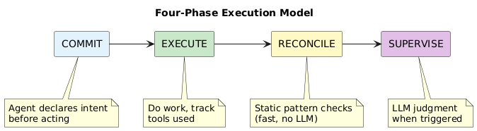
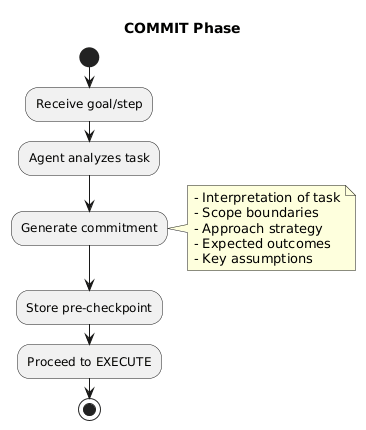
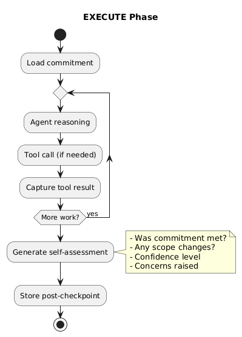

# Chapter 1: Four-Phase Execution

## The Problem

Traditional agent execution is opaque:
1. Agent receives goal
2. Agent does... something
3. Agent returns result

We have no visibility into *what* the agent intended, *how* it interpreted the task, or *whether* it stayed on track. Drift from intended behavior goes undetected.

## The Solution: Declare, Execute, Verify

Every supervised step goes through four phases:



| Phase | Purpose | Output |
|-------|---------|--------|
| COMMIT | Declare intent before acting | Pre-checkpoint |
| EXECUTE | Do the work | Post-checkpoint |
| RECONCILE | Static checks for drift | Flags (if any) |
| SUPERVISE | LLM judgment | Verdict |

## Phase 1: COMMIT

Before executing, the agent must declare:



**Commitment includes:**

| Field | Description |
|-------|-------------|
| `interpretation` | How the agent understands the task |
| `scope` | What's in bounds vs. out of bounds |
| `approach` | Strategy for completing the task |
| `predictions` | Expected outcomes |
| `assumptions` | Things the agent is assuming to be true |

**Example commitment:**

```yaml
interpretation: "Summarize Q4 revenue data from the CSV file"
scope:
  in_bounds: "Read file, extract revenue figures, generate summary"
  out_bounds: "Modifying the file, sending data externally"
approach: "Read CSV, parse columns, calculate totals, format summary"
predictions:
  - "File contains revenue column"
  - "Summary will be 2-3 paragraphs"
assumptions:
  - "File is valid CSV format"
  - "Revenue values are numeric"
```

**Why commit first?**

1. **Accountability** — Agent's interpretation is recorded
2. **Scope boundaries** — Clear limits before execution
3. **Drift detection** — Compare actual behavior to commitment
4. **Audit trail** — What was the agent *trying* to do?

## Phase 2: EXECUTE

The agent performs the actual work:



**During execution:**
- Agent reasoning (chain of thought)
- Tool calls with arguments and results
- Any errors or exceptions

**After execution, agent provides self-assessment:**

| Field | Description |
|-------|-------------|
| `commitment_met` | Did execution match the commitment? |
| `scope_changed` | Did scope expand or shift? |
| `confidence` | How confident is the agent in the result? (0-1) |
| `concerns` | Any issues or uncertainties |

**Example self-assessment:**

```yaml
commitment_met: true
scope_changed: false
confidence: 0.9
concerns: []
```

Or with issues:

```yaml
commitment_met: false
scope_changed: true
confidence: 0.6
concerns:
  - "File format was JSON, not CSV as assumed"
  - "Had to make additional assumptions about data structure"
```

## Checkpoints

Both phases produce checkpoints stored for audit and supervision:

```go
type PreCheckpoint struct {
    StepID        string
    Timestamp     time.Time
    Goal          string
    Interpretation string
    Scope         Scope
    Approach      string
    Predictions   []string
    Assumptions   []string
}

type PostCheckpoint struct {
    StepID        string
    Timestamp     time.Time
    ToolsUsed     []ToolCall
    Output        string
    CommitmentMet bool
    ScopeChanged  bool
    Confidence    float64
    Concerns      []string
}
```

## Unsupervised Execution

For steps without supervision, only COMMIT and EXECUTE run:

```
COMMIT → EXECUTE → (done)
```

Checkpoints are still captured for audit, but RECONCILE and SUPERVISE are skipped.

## When to Use Each Phase

| Situation | Phases Used |
|-----------|-------------|
| Trusted operation, no oversight | COMMIT + EXECUTE |
| Standard supervised step | All four phases |
| Critical step with self-assessment issues | All four + likely SUPERVISE |
| SUPERVISED HUMAN step | All four + human approval |

---

Next: [Reconciliation & Supervision](02-reconciliation-supervision.md)
