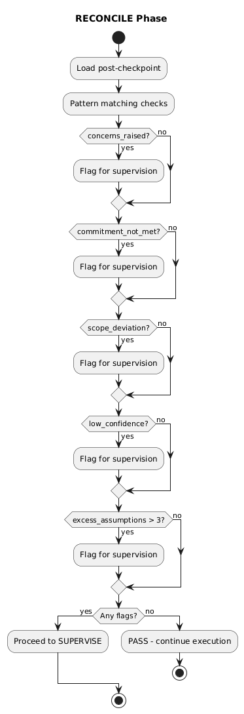
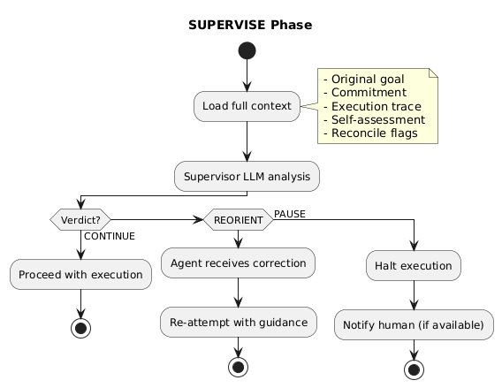
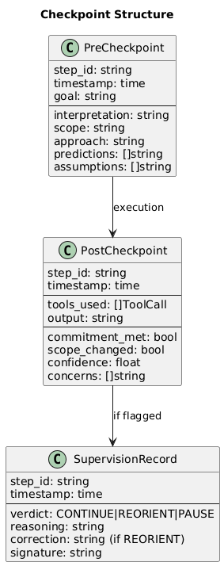

# Chapter 2: Reconciliation & Supervision

## Phase 3: RECONCILE

After execution, the reconcile phase performs fast, deterministic checks:



**Key property:** No LLM calls. Pattern matching only. Runs in milliseconds.

## Reconcile Triggers

The reconciler examines the post-checkpoint and flags issues:

| Trigger | Condition | Severity |
|---------|-----------|----------|
| `concerns_raised` | Agent reported concerns in self-assessment | Medium |
| `commitment_not_met` | Agent says commitment wasn't met | High |
| `scope_deviation` | Scope changed during execution | High |
| `low_confidence` | Confidence < 0.7 | Medium |
| `excess_assumptions` | More than 3 assumptions made | Low |

**If any flags are raised → proceed to SUPERVISE.**

**If no flags → execution continues without supervisor overhead.**

## Why Reconcile First?

The reconcile phase acts as a **cheap filter**:

| Without Reconcile | With Reconcile |
|-------------------|----------------|
| Every step → Supervisor LLM | Every step → Pattern check |
| 100% supervisor cost | ~20% supervisor cost |
| High latency always | Low latency usually |

Most steps complete without issues. Reconcile catches the ones that need attention.

## Phase 4: SUPERVISE

When reconcile flags an issue, the supervisor LLM evaluates the situation:



**Supervisor receives:**
- Original goal
- Agent's commitment (pre-checkpoint)
- Execution trace (tools used, outputs)
- Agent's self-assessment (post-checkpoint)
- Reconcile flags

**Supervisor returns a verdict:** CONTINUE, REORIENT, or PAUSE.

## Supervisor Prompt Structure

```
You are a supervisor agent evaluating execution quality.

ORIGINAL GOAL:
{goal}

AGENT COMMITMENT:
{pre_checkpoint}

EXECUTION TRACE:
{tool_calls_and_results}

AGENT SELF-ASSESSMENT:
{post_checkpoint}

RECONCILE FLAGS:
{flags}

Evaluate whether the agent:
1. Correctly interpreted the goal
2. Stayed within declared scope
3. Achieved the intended outcome
4. Raised appropriate concerns

Respond with:
- VERDICT: CONTINUE | REORIENT | PAUSE
- REASONING: Brief explanation
- CORRECTION: (if REORIENT) Specific guidance for the agent
```

## Checkpoint Storage

All checkpoints are persisted for audit:



```go
type CheckpointStore interface {
    SavePre(stepID string, cp PreCheckpoint) error
    SavePost(stepID string, cp PostCheckpoint) error
    SaveSupervision(stepID string, record SupervisionRecord) error
    
    GetStepHistory(stepID string) (*StepHistory, error)
    GetSessionHistory(sessionID string) ([]StepHistory, error)
}
```

## Example: Reconcile → Supervise Flow

**Step:** Summarize customer data from API

**Pre-checkpoint (COMMIT):**
```yaml
interpretation: "Fetch customer records and generate summary"
scope:
  in_bounds: "Read from customer API, format summary"
  out_bounds: "Modifying customer records, external calls"
assumptions:
  - "API returns JSON"
  - "Customer records have name and email fields"
```

**Post-checkpoint (EXECUTE):**
```yaml
commitment_met: false
scope_changed: true
confidence: 0.5
concerns:
  - "API returned paginated results, had to make multiple calls"
  - "Some records missing email field"
  - "Called external validation service to verify emails"
```

**Reconcile flags:**
- `commitment_not_met`: true
- `scope_deviation`: true (called external service)
- `low_confidence`: true (0.5)
- `concerns_raised`: true

**Supervisor verdict:**
```
VERDICT: REORIENT
REASONING: Agent called external validation service which was outside 
declared scope. The core task of summarizing is valid, but external 
calls were not authorized.
CORRECTION: Complete the summary using only data from the customer API. 
Do not call external services. Note missing emails in the summary 
rather than attempting to validate them.
```

---

Next: [Supervision Modes](03-supervision-modes.md)
