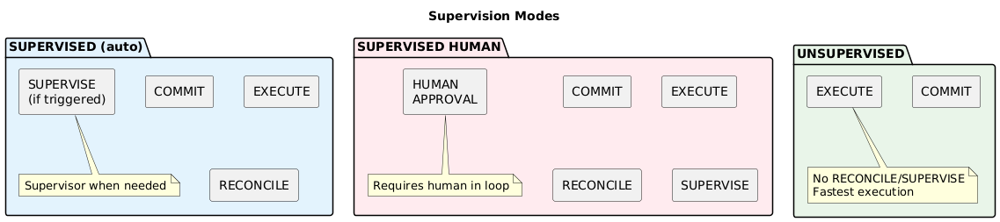

# Chapter 3: Supervision Modes

## Three Levels of Oversight

The supervision system supports three modes, from lightest to strictest:



## Mode Comparison

| Mode | Phases | Supervisor | Human | Use Case |
|------|--------|------------|-------|----------|
| UNSUPERVISED | COMMIT + EXECUTE | Never | Never | Dev/test, trusted ops |
| SUPERVISED | All four | When flagged | Never | Production |
| SUPERVISED HUMAN | All four | Always | Required | Critical/compliance |

## Default Behavior

**Goals without a supervision keyword are UNSUPERVISED.**

This is the fastest execution path. Only COMMIT and EXECUTE phases run.

```
NAME quick-analysis
GOAL analyze "Analyze the log file and report errors"
```

**Behavior:**
- Agent commits and executes
- No reconciliation checks
- No supervisor oversight
- Checkpoints still captured for audit

**When appropriate:**
- Development and testing
- Trusted internal tools
- Low-risk operations
- Maximum performance needed

## SUPERVISED

Add `SUPERVISED` at end of goal line for production oversight. All four phases run, but supervisor only engages when reconcile flags issues.

```
NAME data-pipeline
GOAL process "Process customer data and generate report" SUPERVISED
```

**Behavior:**
- Agent commits and executes
- Reconcile checks for drift signals
- Supervisor called only if flags raised
- Most steps pass without supervisor overhead

**When to use:**
- Production workloads
- Standard workflows
- Balance of safety and performance

## SUPERVISED HUMAN

Maximum oversight. Supervisor always runs, and human approval required.

```
NAME production-deploy
GOAL deploy "Deploy version 2.1 to production servers" SUPERVISED HUMAN
```

**Behavior:**
- Agent commits and executes
- Reconcile checks run
- Supervisor always evaluates (even if no flags)
- Human must approve before continuing
- Execution pauses waiting for human

**When to use:**
- Critical operations (deployments, deletions)
- Sensitive data processing
- Compliance requirements
- High-risk tool usage

## UNSUPERVISED (Explicit)

Use `UNSUPERVISED` to explicitly opt out of supervision for a specific goal when global supervision is enabled:

```
SUPERVISED
NAME mixed-workflow
GOAL fetch "Fetch data from API"
GOAL analyze "Analyze the data" UNSUPERVISED
GOAL report "Generate report for stakeholders"
```

In this example, `fetch` and `report` inherit global SUPERVISED, but `analyze` is explicitly UNSUPERVISED.

## Pre-Flight Check

Before execution begins, the system validates supervision requirements.

If SUPERVISED HUMAN is required but no human connection exists → **fail immediately**.

Don't start a workflow that will inevitably stall waiting for a human who isn't there.

## Global Supervision

Place `SUPERVISED` or `SUPERVISED HUMAN` at top of file to set a default for all goals:

```
SUPERVISED
NAME my-workflow
GOAL step1 "First goal - inherits SUPERVISED"
GOAL step2 "Second goal - also SUPERVISED"
GOAL step3 "Third goal - explicit override" UNSUPERVISED
```

Goals can still override with explicit modifiers.

## Configuration (agent.toml)

```toml
[supervision]
model = "claude-sonnet"
human_timeout_seconds = 300
```

| Setting | Description |
|---------|-------------|
| model | LLM for supervisor |
| human_timeout_seconds | Timeout waiting for human approval |

## Mode Inheritance

| Global Setting | Goal Modifier | Result |
|----------------|---------------|--------|
| (none) | (none) | UNSUPERVISED |
| (none) | SUPERVISED | SUPERVISED |
| (none) | SUPERVISED HUMAN | SUPERVISED HUMAN |
| SUPERVISED | (none) | SUPERVISED |
| SUPERVISED | UNSUPERVISED | UNSUPERVISED |
| SUPERVISED | SUPERVISED HUMAN | SUPERVISED HUMAN |
| SUPERVISED HUMAN | (none) | SUPERVISED HUMAN |
| SUPERVISED HUMAN | UNSUPERVISED | **Error** (cannot downgrade) |

**Rule:** Goals can escalate or downgrade supervision, except when global is SUPERVISED HUMAN — then downgrading is an error.

---

Next: [Workflow Processing](04-workflow-processing.md)
