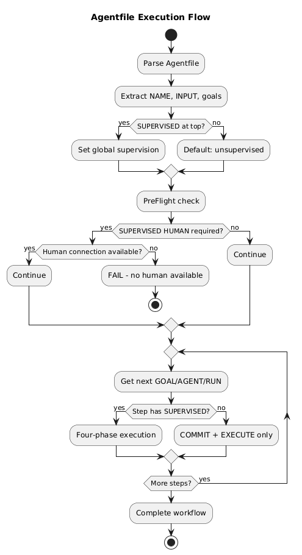
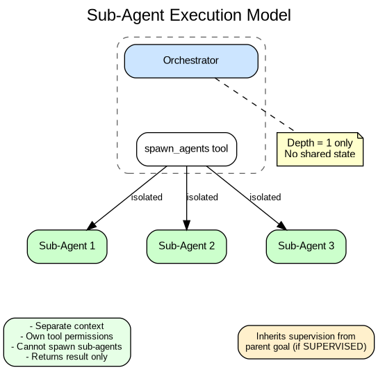

# Chapter 4: Workflow Processing

## Agentfile Structure

The Agentfile defines a workflow using a flat, declarative syntax:

```
NAME deploy-service
INPUT version
INPUT environment

SUPERVISED

GOAL build "Build and test version {version}"
GOAL deploy "Deploy to {environment} servers" SUPERVISED HUMAN
GOAL verify "Verify deployment health"
```

**Key syntax rules:**
- One instruction per line
- No indentation or nesting
- GOAL followed by identifier, then quoted string
- Supervision modifier at end of line (not before GOAL)

## Execution Flow



## Parsing Phase

The lexer/parser converts the Agentfile into a workflow structure:

| Field | Description |
|-------|-------------|
| Name | Workflow identifier |
| Inputs | Required parameters |
| Supervised | Global supervision flag |
| HumanOnly | Global human requirement |
| Goals | List of goal definitions |

Each goal has:

| Field | Description |
|-------|-------------|
| Name | Goal identifier |
| Outcome | The goal string |
| Supervised | Goal-level override (pointer, nil = inherit) |
| HumanOnly | Goal-level human requirement |

## Pre-Flight Validation

Before execution begins:

1. **Check supervision requirements**
   - If any goal requires SUPERVISED HUMAN
   - And no human connection available
   - → Fail immediately

2. **Validate inputs**
   - All declared INPUTs must be provided

3. **Tool availability**
   - Referenced tools must be registered
   - Permissions checked against policy

## Goal Execution

Each goal goes through the appropriate phases based on its supervision setting:

| Supervision | Phases |
|-------------|--------|
| UNSUPERVISED | COMMIT → EXECUTE |
| SUPERVISED | COMMIT → EXECUTE → RECONCILE → (SUPERVISE if flagged) |
| SUPERVISED HUMAN | COMMIT → EXECUTE → RECONCILE → SUPERVISE → HUMAN |

## Sub-Agent Spawning

The `spawn_agents` tool enables parallel sub-agent execution:



**Key constraints:**

| Property | Value |
|----------|-------|
| Maximum depth | 1 (no nested spawning) |
| State sharing | None (complete isolation) |
| Context | Separate per sub-agent |
| Permissions | Own policy, cannot escalate |
| Return | Result only, no side channels |

**Sub-agents:**
- Run in parallel when multiple are spawned
- Each has isolated context
- Results collected by orchestrator
- Cannot spawn further sub-agents

## Error Handling

| Error Type | Behavior |
|------------|----------|
| Tool failure | Captured in post-checkpoint, may trigger reconcile |
| LLM error | Retry with backoff, fail after 5 attempts |
| Supervision timeout | PAUSE verdict, escalate to human if available |
| Human timeout | Configurable: fail or continue with warning |
| Pre-flight failure | Immediate abort before execution |

## Workflow Completion

A workflow completes when:
- All goals execute successfully, OR
- A goal receives PAUSE verdict with no human resolution, OR
- An unrecoverable error occurs

**On completion:**
- Final checkpoint saved
- Session log finalized
- Results returned to caller

---

Next: [Supervisor Verdicts](05-supervisor-verdicts.md)
