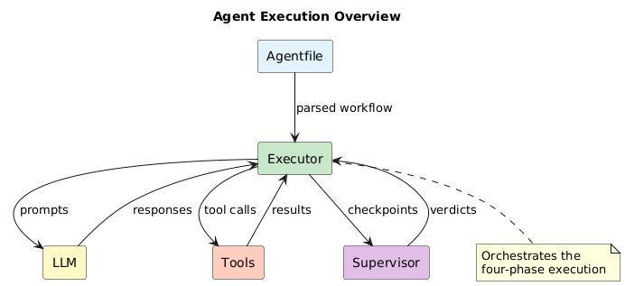

# Execution Model Documentation

This documentation describes the agent execution architecture, supervision system, and workflow processing.

## Contents

| Chapter | Title | Description |
|---------|-------|-------------|
| 1 | [Four-Phase Execution](01-four-phase-execution.md) | COMMIT → EXECUTE → RECONCILE → SUPERVISE |
| 2 | [Reconciliation & Supervision](02-reconciliation-supervision.md) | Drift detection and correction |
| 3 | [Supervision Modes](03-supervision-modes.md) | UNSUPERVISED, SUPERVISED, SUPERVISED HUMAN |
| 4 | [Workflow Processing](04-workflow-processing.md) | Agentfile parsing and execution |
| 5 | [Supervisor Verdicts](05-supervisor-verdicts.md) | CONTINUE, REORIENT, PAUSE |

## Overview

The headless agent uses a four-phase execution model with optional supervision:

## Core Principles

1. **Declare before acting** — Agent commits to an approach before execution
2. **Self-assessment** — Agent evaluates its own work after completion
3. **Tiered oversight** — Static checks first, LLM supervision only when needed
4. **Human escalation** — Critical steps can require human approval

## Quick Reference

| Phase | Purpose | Cost |
|-------|---------|------|
| COMMIT | Agent declares intent | 1 LLM call |
| EXECUTE | Do the actual work | N LLM calls + tools |
| RECONCILE | Static pattern checks | ~0 (no LLM) |
| SUPERVISE | LLM-based judgment | 1 LLM call (when triggered) |

## Execution Supervisor vs Security Supervisor

The execution supervisor described here is **not** a sub-agent. It's an on-demand LLM call made when RECONCILE flags drift issues.

| Term | What It Is | When It Runs |
|------|------------|--------------|
| Execution supervisor | On-demand LLM call | Per goal when RECONCILE flags issues |
| Security supervisor | On-demand LLM call | Per tool call when security tiers escalate |

Both are stateless verification calls. A workflow does not spawn additional sub-agents for supervision.

**Important:** Security checks are always on, regardless of execution supervision mode. An `UNSUPERVISED` goal skips the four-phase execution overhead but still runs security verification on tool calls when untrusted content is present.

See [Security Documentation](../security/README.md) for details on security supervision.

## When to Use Supervision

| Scenario | Recommendation |
|----------|----------------|
| Development/testing | No keyword (UNSUPERVISED) |
| Internal tools, trusted data | No keyword (UNSUPERVISED) |
| Production, trusted users | SUPERVISED |
| Critical operations | SUPERVISED |
| Sensitive data, compliance | SUPERVISED HUMAN |
| Public-facing agents | SUPERVISED + paranoid security |

See [Supervision Modes](03-supervision-modes.md) for configuration details.
