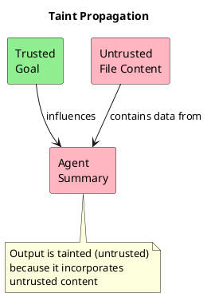
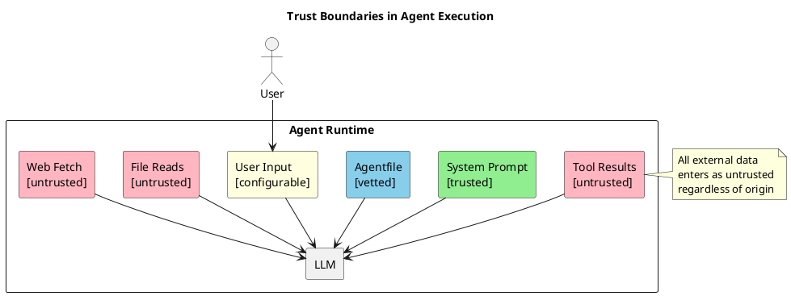

# Chapter 2: Trust Boundaries

## The Trust Model

Every piece of content in the agent's context has an origin. We classify origins by trust level:

```
┌─────────────────────────────────────────────────────────────┐
│                      TRUST LEVELS                           │
├──────────────┬──────────────────────────────────────────────┤
│   TRUSTED    │  Framework-generated, cannot be influenced   │
│              │  by external sources                         │
├──────────────┼──────────────────────────────────────────────┤
│   VETTED     │  Human-authored and reviewed                 │
│              │  (Agentfiles, signed packages)               │
├──────────────┼──────────────────────────────────────────────┤
│  UNTRUSTED   │  External data that may contain              │
│              │  malicious content                           │
└──────────────┴──────────────────────────────────────────────┘
```

## Trust Assignment

Trust levels are assigned **implicitly by the framework** based on content origin. This is not configurable per-source — the control flow determines trust.

| Content Source | Trust Level | Rationale |
|----------------|-------------|-----------|
| System prompt | trusted | Framework-generated |
| Agentfile definitions | vetted | Human-authored, potentially signed |
| Skill instructions (from package) | vetted | Signed package |
| Agent's own reasoning | trusted | Agent's output |
| Agent commitment (COMMIT phase) | trusted | Agent's declared intent |
| Supervisor messages | trusted | Framework component |
| Tool call arguments | trusted | Agent-generated |
| **Tool results** | **untrusted** | External data |
| **File reads** | **untrusted** | External data |
| **Web fetches** | **untrusted** | External data |
| **MCP responses** | **untrusted** | External server |
| **Bash output** | **untrusted** | External execution |
| **Sub-agent output** | **untrusted** | May have processed untrusted data |

### User Input — The Exception

User messages are the one configurable trust level:

```toml
[security]
user_trust = "trusted"    # Internal deployment, known users
# or
user_trust = "untrusted"  # Public-facing, unknown users
```

**When to use `untrusted`:**
- Public-facing agents
- Users may be subject to social engineering
- Multi-tenant environments

## Trust Propagation (Taint Tracking)

When content from multiple sources is combined, the result inherits the **lowest** trust level:

```
trusted   + trusted   → trusted
trusted   + vetted    → vetted
trusted   + untrusted → untrusted
vetted    + untrusted → untrusted
```



### Instruction Taint vs Data Taint

There's an important distinction:

- **Data taint**: Content flows through but doesn't change agent behavior
  - Agent reads file → summarizes → writes summary
  - The *what* is tainted, the *why* is not

- **Instruction taint**: Content changes agent decisions
  - Agent reads file → file says "delete everything" → agent deletes
  - The *why* is corrupted

Our primary concern is **instruction taint** — when untrusted content influences what the agent decides to do, not just what data it handles.

## The Invariant

Regardless of configuration:

> **Untrusted content is NEVER treated as instructions.**

This is not configurable. The security modes (default/paranoid) control verification overhead, not this fundamental rule.

## Visual Summary



---

Next: [The Block System](03-block-system.md)
