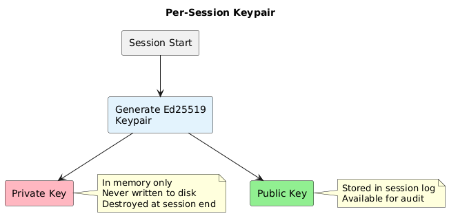
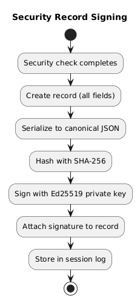

# Chapter 6: Cryptographic Audit Trail

## Purpose

Even with all defenses, attacks may succeed. The audit trail enables:

- **Detection**: Identify that an attack occurred
- **Forensics**: Understand what happened and how
- **Non-repudiation**: Prove the supervisor made specific decisions
- **Compliance**: Demonstrate security controls were active

## Per-Session Keypair

Each session generates a fresh Ed25519 keypair:



**Why Ed25519?**
- Fast signing (~15,000 signatures/second on modern CPU)
- Small signatures (64 bytes)
- Well-audited, no known weaknesses
- Simple implementation (no configuration complexity)

## What Gets Signed

The supervisor signs a record after each security decision.

**Signed Security Record fields:**

| Field | Description |
|-------|-------------|
| block_id | Identifier for the content block |
| session_id | Session identifier |
| timestamp | When the decision was made |
| content_hash | SHA-256 of block content |
| trust | Trust level (trusted/vetted/untrusted) |
| type | Block type (instruction/data) |
| tier1_result | "pass" or "escalate" |
| tier2_result | "pass", "escalate", or "skipped" |
| tier3_result | Verdict or "skipped" |
| signature | Base64-encoded Ed25519 signature |

## Signing Process



**Canonical JSON**: Fields sorted alphabetically, consistent whitespace. Ensures same content always produces same hash.

**Process:**
1. Security check completes
2. Create record with all fields except signature
3. Serialize to canonical JSON
4. Hash with SHA-256
5. Sign hash with session private key
6. Attach signature to record
7. Store in session log

## Session Log Structure

Each session log contains:

| Field | Description |
|-------|-------------|
| session_id | Unique session identifier |
| started_at | Session start timestamp |
| public_key | Ed25519 public key for verification |
| security_mode | "default" or "paranoid" |
| security_records | Array of signed records |

## Verification

Auditors verify records by:
1. Extracting the record (without signature field)
2. Serializing to canonical JSON
3. Hashing with SHA-256
4. Verifying Ed25519 signature against session public key

If verification fails, the record has been tampered with.

## What The Trail Proves

| Observation | Meaning |
|-------------|---------|
| Valid signature on record | Supervisor actually made this decision |
| tier1_result = "pass" | No untrusted content was present |
| tier3_result = "CONTINUE" | Supervisor judged action as safe |
| tier3_result = "REORIENT" | Supervisor detected and corrected drift |
| Missing record for action | Security system was bypassed (red flag!) |

## Tampering Detection

An attacker who compromises the agent cannot forge signatures:
- Private key is in memory only
- Session ends → key is destroyed
- Modifying logged records invalidates signatures
- Removing records leaves gaps (detectable)

**Limitation**: An attacker with memory access during the session could extract the private key. Defense against this requires hardware security modules (HSMs), which are out of scope for this system.

## Storage Configuration

```toml
[security.audit]
log_path = "/var/log/agent/security/"
retention_days = 90
```

| Setting | Description |
|---------|-------------|
| log_path | Directory for session logs |
| retention_days | How long to keep logs |

Optional SIEM integration available for shipping logs to external systems.

**For compliance-critical deployments:**
- Ship logs to immutable storage (S3 with Object Lock, WORM storage)
- Include logs in regular backup verification
- Set up alerting on verification failures

---

Next: [Security Modes](07-security-modes.md)
