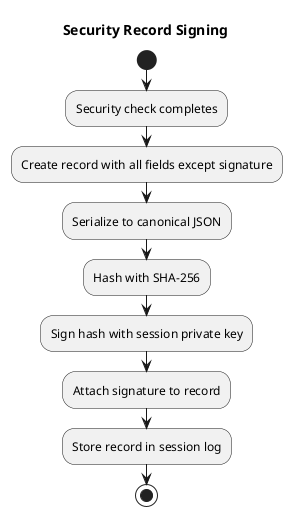

# Chapter 6: Cryptographic Audit Trail

## Purpose

Even with all defenses, attacks may succeed. The audit trail enables:

- **Detection**: Identify that an attack occurred
- **Forensics**: Understand what happened and how
- **Non-repudiation**: Prove the supervisor made specific decisions
- **Compliance**: Demonstrate security controls were active

## Per-Session Keypair

Each session generates a fresh Ed25519 keypair:

```
Session Start
    │
    ▼
┌──────────────────────────────────────┐
│  Generate Ed25519 Keypair            │
│                                      │
│  Private Key: In memory only         │
│               Never written to disk  │
│               Destroyed at end       │
│                                      │
│  Public Key:  Stored in session log  │
│               Available for audit    │
└──────────────────────────────────────┘
```

**Why Ed25519?**
- Fast signing (~15,000 signatures/second on modern CPU)
- Small signatures (64 bytes)
- Well-audited, no known weaknesses
- Simple implementation (no configuration complexity)

## What Gets Signed

The supervisor signs a record after each security decision:

```go
type SignedSecurityRecord struct {
    // Identity
    BlockID     string    `json:"block_id"`
    SessionID   string    `json:"session_id"`
    Timestamp   time.Time `json:"timestamp"`
    
    // What was checked
    ContentHash string    `json:"content_hash"`  // SHA-256 of block content
    Trust       string    `json:"trust"`
    Type        string    `json:"type"`
    
    // Verification results
    Tier1Result string    `json:"tier1_result"`  // "pass" | "escalate"
    Tier2Result string    `json:"tier2_result"`  // "pass" | "escalate" | "skipped"
    Tier3Result string    `json:"tier3_result"`  // verdict or "skipped"
    
    // The signature
    Signature   string    `json:"signature"`     // base64(Ed25519(hash(above)))
}
```

## Signing Process



**Canonical JSON**: Fields sorted alphabetically, consistent whitespace. Ensures same content always produces same hash.

## Session Log Structure

```json
{
  "session_id": "sess_abc123",
  "started_at": "2026-02-06T19:30:00Z",
  "public_key": "MCowBQYDK2VwAyEA...",
  "security_mode": "default",
  
  "security_records": [
    {
      "block_id": "tool-read-1",
      "session_id": "sess_abc123",
      "timestamp": "2026-02-06T19:30:05Z",
      "content_hash": "a3f2b8c9...",
      "trust": "untrusted",
      "type": "data",
      "tier1_result": "escalate",
      "tier2_result": "pass",
      "tier3_result": "skipped",
      "signature": "MEUCIQD2..."
    },
    {
      "block_id": "tool-bash-1",
      "session_id": "sess_abc123",
      "timestamp": "2026-02-06T19:30:10Z",
      "content_hash": "b4c3d9e0...",
      "trust": "trusted",
      "type": "instruction",
      "tier1_result": "escalate",
      "tier2_result": "escalate",
      "tier3_result": "CONTINUE",
      "signature": "MEYCIQCx..."
    }
  ]
}
```

## Verification

Auditors can verify any record:

```go
func VerifySecurityRecord(record SignedSecurityRecord, publicKey ed25519.PublicKey) bool {
    // Recreate canonical JSON (without signature field)
    recordCopy := record
    recordCopy.Signature = ""
    canonical, _ := json.Marshal(recordCopy)
    
    // Hash
    hash := sha256.Sum256(canonical)
    
    // Decode signature
    sig, _ := base64.StdEncoding.DecodeString(record.Signature)
    
    // Verify
    return ed25519.Verify(publicKey, hash[:], sig)
}
```

## What The Trail Proves

| If you see... | It means... |
|---------------|-------------|
| Valid signature on record | Supervisor actually made this decision |
| tier1_result = "pass" | No untrusted content was present |
| tier3_result = "CONTINUE" | Supervisor judged action as safe |
| tier3_result = "REORIENT" | Supervisor detected and corrected drift |
| Missing record for action | Security system was bypassed (red flag!) |

## Tampering Detection

An attacker who compromises the agent cannot forge signatures:
- Private key is in memory only
- Session ends → key is destroyed
- Modifying logged records invalidates signatures
- Removing records leaves gaps (detectable)

**Limitation**: An attacker with memory access during the session could extract the private key. Defense against this requires hardware security modules (HSMs), which are out of scope for this system.

## Storage Recommendations

```toml
[security.audit]
# Where to store session logs with signatures
log_path = "/var/log/agent/security/"

# Retention
retention_days = 90

# Optional: Ship to external SIEM
siem_endpoint = "https://siem.example.com/ingest"
siem_token_env = "SIEM_API_TOKEN"
```

For compliance-critical deployments:
- Ship logs to immutable storage (S3 with Object Lock, WORM storage)
- Include logs in regular backup verification
- Set up alerting on verification failures

---

Next: [Security Modes](07-security-modes.md)
