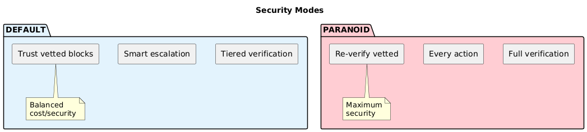

# Chapter 7: Security Modes

## Three Modes

The system operates in one of three security modes:



## Mode Comparison

| Aspect | Default | Paranoid | Research |
|--------|---------|----------|----------|
| Tier 1 (deterministic) | Always | Always | Always |
| Tier 2 (triage) | When Tier 1 escalates | Always | When Tier 1 escalates |
| Tier 3 (full supervisor) | When Tier 2 escalates | Always | Research-aware prompts |
| Vetted content | Trusted | Re-verified by supervisor | Trusted |
| Encoded content | Escalate to Tier 2 | Escalate to Tier 3 | Escalate to Tier 2 |
| Security research activities | May be blocked | Will be blocked | Allowed within scope |
| Scope enforcement | N/A | N/A | Strict at boundaries |
| Performance overhead | Low | High | Low-Medium |

## Configuration

```toml
# agent.toml

[security]
# Security mode: "default" or "paranoid"
mode = "default"

# Trust level for user messages
# "trusted" - internal deployment, known users
# "untrusted" - public-facing, unknown users
user_trust = "trusted"
```

**In Agentfile:**

```
# Set security mode for this workflow
SECURITY paranoid

NAME sensitive-workflow
...
```

**Research mode (requires scope):**

```
# Enable research mode with scope declaration
SECURITY research "authorized pentest of internal lab environment"

NAME security-research-workflow
...
```

Agentfile setting overrides config file (more restrictive wins, except research which is a separate mode).

## When to Use Each Mode

### Default Mode

Choose for:
- Internal tools with trusted users
- Development and testing
- Workflows processing trusted data sources
- Cost-sensitive deployments

```toml
[security]
mode = "default"
user_trust = "trusted"
```

### Paranoid Mode

Choose for:
- Public-facing agents
- Processing sensitive/regulated data (PII, financial, health)
- Workflows with high-risk tools (bash, external APIs)
- Compliance requirements (SOC2, HIPAA, etc.)
- When user input cannot be trusted

```toml
[security]
mode = "paranoid"
user_trust = "untrusted"
```

### Research Mode

Choose for:
- Penetration testing and red team activities
- Vulnerability assessment and security audits
- Malware analysis and threat research
- CTF challenges and security training
- Any legitimate security research

```
# In Agentfile only - must declare scope
SECURITY research "your authorized scope description"
```

**Research mode features:**

1. **Scope-aware supervision** - The security supervisor understands the research context and allows security-related activities within the declared scope

2. **Defensive framing** - System prompts include context indicating authorized security research, which helps with LLM cooperation

3. **Boundary enforcement** - Actions targeting systems outside the declared scope are still blocked

4. **Full audit trail** - All actions remain logged and signed for accountability

**Example scopes:**

```
SECURITY research "vulnerability assessment of web app at app.internal.corp"
SECURITY research "authorized pentest of lab network 192.168.100.0/24"
SECURITY research "malware analysis in isolated sandbox environment"
SECURITY research "CTF challenge solving for security training"
```

## Invariants (All Modes)

These rules apply regardless of mode:

1. **Untrusted content is never treated as instructions**
   - Block type enforcement is not configurable

2. **Encoded content in untrusted blocks always escalates**
   - Minimum: Tier 2 in default/research mode
   - Minimum: Tier 3 in paranoid mode

3. **All security decisions are signed**
   - Audit trail is always active

4. **Tool restrictions are always enforced**
   - Policy.toml allowlists/denylists apply in all modes

5. **Research mode scope is enforced**
   - Actions outside declared scope are blocked even in research mode

## Workflow-Level Override

Individual workflows can escalate (but not reduce) security:

```
# In Agentfile

# This workflow handles PII, use paranoid mode
SECURITY paranoid

NAME user-data-processor
INPUT user_id
...
```

If config says `default` but Agentfile says `paranoid`, paranoid applies.

A workflow **cannot** reduce security below the config level:
- Config: `paranoid` + Agentfile: `default` → paranoid applies
- Config: `default` + Agentfile: `paranoid` → paranoid applies

Research mode is a separate category that enables security research workflows while maintaining scope boundaries.

## Runtime Mode Indication

The agent logs its security mode at startup:

```
INFO  2026-02-06T19:30:00.000Z [security] mode=default user_trust=trusted
```

In paranoid mode:
```
INFO  2026-02-06T19:30:00.000Z [security] mode=paranoid user_trust=untrusted
WARN  2026-02-06T19:30:00.000Z [security] paranoid mode active - all tool calls will be verified
```

In research mode:
```
🔓 Security: mode=research, scope="authorized pentest of internal lab environment"
```

---

Next: [Testing Your Model](08-model-testing.md)
