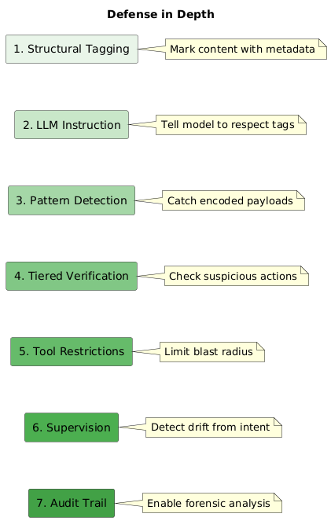

# Security Documentation

This documentation describes the security architecture of the headless agent system.

## Contents

| Chapter | Title | Description |
|---------|-------|-------------|
| 1 | [The Threat Model](01-threat-model.md) | What we're defending against |
| 2 | [Trust Boundaries](02-trust-boundaries.md) | How we classify content |
| 3 | [The Block System](03-block-system.md) | Structural separation of instruction and data |
| 4 | [Encoded Content Detection](04-encoded-content.md) | Detecting obfuscated payloads |
| 5 | [Tiered Verification](05-tiered-verification.md) | Efficient security checks |
| 6 | [Cryptographic Audit Trail](06-audit-trail.md) | Non-repudiable supervision records |
| 7 | [Security Modes](07-security-modes.md) | Default vs Paranoid configuration |
| 8 | [Taint Lineage](08-taint-lineage.md) | Tracking the origin of untrusted content |
| 9 | [Testing Your Model](09-model-testing.md) | Evaluating LLM security compliance |

## Core Principle

LLMs cannot reliably distinguish instructions from data. Everything is tokens.

Our approach: **Defense in depth**



No single layer is sufficient. Together, they raise the bar significantly.

## Security vs Execution Supervision

This documentation references a "security supervisor" in Tier 3 verification. This is **not** a sub-agent.

| Term | What It Is | When It Runs |
|------|------------|--------------|
| Security supervisor | On-demand LLM call | Per tool call when Tier 1+2 escalate |
| Execution supervisor | On-demand LLM call | Per goal when RECONCILE flags issues |

Both are stateless verification calls, not persistent agents. A workflow does not spawn additional sub-agents for supervision.

**Security checks are always on.** Even goals marked `UNSUPERVISED` (which skip execution supervision) still run security verification on tool calls when untrusted content is present.

## Related Documentation

- [Design](../design/README.md) — Architecture, DSL, LLM integration, tools, protocols
- [Execution Model](../execution/README.md) — Four-phase execution, supervision modes, verdicts

## Quick Start

For most deployments, the default security mode provides good protection:

```toml
# agent.toml
[security]
mode = "default"
user_trust = "trusted"  # or "untrusted" for public deployments
```

For high-security environments:

```toml
[security]
mode = "paranoid"
user_trust = "untrusted"
```

See [Security Modes](07-security-modes.md) for details.
